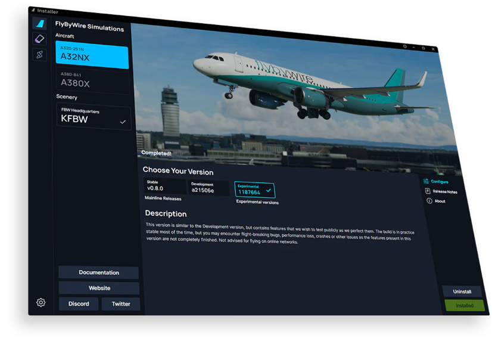

# Overview

Our custom-built, open-source installer is where we keep our projects for you to easily install. Pick which feature branch you would like to use, and the installer will 
automatically download it into the proper folder. The installer will always check if a new release is available prompting an update when you launch the application.

{loading=lazy}

Our installer also features SimBridge - our custom-built application to utilize remote tools. Check out the dedicated page for upcoming features and their status:

[SimBridge](../docs/tools/simbridge/index.md){ .md-button }

---

## Other Aircraft

We have bundled a couple other open-source aircraft maintained by their respective organizations:

- Salty Simulations 74S (B747-8I) - Available Now!
    - [:fontawesome-brands-discord:{: .discord } **Discord**](https://discord.com/invite/S4PJDwk)
- Synaptic Simulations A22X (A220-300) - In Development.
    - [**Website**](https://www.synapticsim.com/)
    - [:fontawesome-brands-discord:{: .discord } **Discord**](https://discord.com/invite/acQkSvrePG)