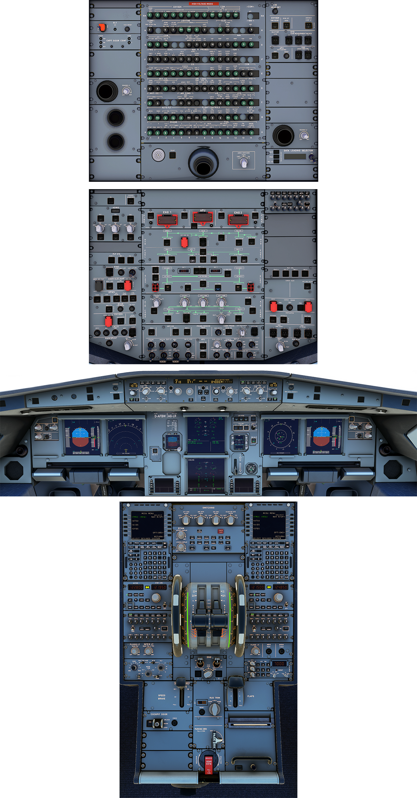

---
hide:
    - navigation
    - toc
---

# Flight Deck Overview

- Clickable overview of the A320neo flight deck.
- Move the mouse over the panels to get the name of the panel.
- Click on the panels to get a more detailed description of that panel (if available yet).

{usemap="#cockpit_map" style="max-width:1188px;min-width:1188px;height=auto;"}

<map name="cockpit_map">
  <area title="Circuit Breaker Panel" shape="rect" coords="403,2,758,408" href="#">
  <area title="Maintenance Panel" shape="rect" coords="757,1,907,179" href="#">
  <area title="FMS Load Panel" shape="rect" coords="756,424,909,470" href="#">
  <area title="F.O. Light" shape="rect" coords="759,350,907,424" href="#">
  <area title="CAPT Light" shape="rect" coords="255,223,401,299" href="#">
  <area title="Pedestal Light" shape="rect" coords="404,408,757,518" href="#">
  <area title="Cockpit Door Panel" shape="rect" coords="254,96,400,143" href="#">
  <area title="ELT Panel" shape="rect" coords="254,58,401,96" href="#">

  <area title="3rd Audio Control Panel" shape="rect" coords="754,537,908,608" href="#">
  <area title="PA and Cockpit Door Video" shape="rect" coords="256,552,402,588" href="#">
  <area title="ADIRS Panel" shape="rect" coords="255,588,404,689" href="#">
  <area title="Flight Control Panel Left" shape="rect" coords="255,717,404,752" href="#">
  <area title="Evacuation Panel" shape="rect" coords="256,754,405,793" href="#">
  <area title="Emergency Electric Power Panel" shape="rect" coords="254,793,404,829" href="#">
  <area title="Fire Control Panel" shape="rect" coords="405,594,754,652" href="/a32nx-briefing/ovhd/fire/">
  <area title="Hydraulic Control Panel" shape="rect" coords="404,653,754,707" href="/a32nx-briefing/ovhd/hyd/">
  <area title="Fuel Control Panel" shape="rect" coords="404,707,754,754" href="/a32nx-briefing/ovhd/fuel/">
  <area title="Electricity Control Panel" shape="rect" coords="404,754,754,836" href="#">
  <area title="Air Condition Control Panel" shape="rect" coords="404,836,754,923" href="#">
  <area title="Cabin Pressure Control Panel" shape="rect" coords="603,923,754,961" href="#">
  <area title="Anti Ice Control Panel" shape="rect" coords="406,922,604,964" href="#">
  <area title="External Lights Panel" shape="rect" coords="405,965,557,1035" href="#">
  <area title="APU Panel" shape="rect" coords="558,965,593,1034" href="#">
  <area title="Ground Proximity Warning Panel" shape="rect" coords="256,828,403,865" href="#">
  <area title="Voice Recoder Panel" shape="rect" coords="258,865,402,892" href="#">
  <area title="Oxygen Panel" shape="rect" coords="264,892,402,929" href="#">
  <area title="Calls Panel" shape="rect" coords="261,929,403,960" href="#">
  <area title="Wiper Panel Capt." shape="rect" coords="264,962,404,1002" href="#">
  <area title="Internal Lighting Panel" shape="rect" coords="595,960,751,995" href="#">
  <area title="Sign Panel" shape="rect" coords="596,995,751,1029" href="#">
  <area title="Flight Control Panel Right" shape="rect" coords="754,759,899,794" href="#">
  <area title="Cargo Ventilation Panel" shape="rect" coords="754,796,899,847" href="#">
  <area title="Cargo Smoke Panel" shape="rect" coords="755,849,904,890" href="#">
  <area title="Ventilation Panel" shape="rect" coords="755,890,903,926" href="#">
  <area title="Engine Manual Start and N1 Mode Panel" shape="rect" coords="755,926,903,964" href="#">
  <area title="Wiper Panel F.O." shape="rect" coords="754,965,902,1009" href="#">

  <area title="Flight Control Unit" shape="rect" coords="478,1070,681,1145" href="/a32nx-briefing/glareshield/fcu/">
  <area title="EFIS Control Unit Capt." shape="rect" coords="356,1072,477,1147" href="/a32nx-briefing/glareshield/efis_control/">
  <area title="EFIS Control Unit F.O." shape="rect" coords="680,1073,802,1144" href="/a32nx-briefing/glareshield/efis_control/">
  <area title="Alarms and Warnings Capt." shape="rect" coords="79,1072,354,1149" href="#">
  <area title="Alarms and Warnings F.O." shape="rect" coords="804,1073,1049,1144" href="#">
  <area title="EFIS Instruments Capt." shape="rect" coords="90,1173,415,1307" href="#">
  <area title="EFIS Instruments F.O." shape="rect" coords="745,1172,1072,1308" href="#">
  <area title="StdBy Instruments" shape="rect" coords="417,1174,526,1410" href="#">
  <area title="ECAM" shape="rect" coords="525,1173,646,1410" href="#">
  <area title="Aurobrake and Gear" shape="rect" coords="648,1398,650,1410" href="#">

  <area title="Switching Panel" shape="rect" coords="490,1434,697,1498" href="#">
  <area title="ECAM Control Panel" shape="rect" coords="491,1499,697,1572" href="#">
  <area title="MCDU Capt." shape="rect" coords="348,1429,496,1652" href="#">
  <area title="MCDU F.O." shape="rect" coords="696,1428,840,1656" href="#">
  <area title="RMP and Audio Control Capt." shape="rect" coords="349,1652,488,1828" href="#">
  <area title="RMP and Audio Control F.O." shape="rect" coords="698,1656,838,1827" href="#">
  <area title="Thrust Lever and Elevation Trim" shape="rect" coords="488,1634,697,1867" href="#">
  <area title="Engine Panel" shape="rect" coords="543,1867,646,1940" href="#">
  <area title="Lighting Capt." shape="rect" coords="352,1827,488,1873" href="#">
  <area title="Lighting, AIDS, DFDR F.O." shape="rect" coords="699,1827,832,1874" href="#">
  <area title="Radar Panel" shape="rect" coords="353,1874,491,1938" href="#">
  <area title="ATC and TCAS Panel" shape="rect" coords="695,1873,834,1932" href="#">
  <area title="Speed Brake" shape="rect" coords="490,1926,546,2024" href="#">
  <area title="Flaps" shape="rect" coords="642,1917,699,2023" href="#">
  <area title="Cockpit Door Panel" shape="rect" coords="408,2022,523,2080" href="#">
  <area title="Rudder Trim" shape="rect" coords="550,1974,640,2041" href="#">
  <area title="Printer" shape="rect" coords="641,2027,782,2072" href="#">
  <area title="Parking Brake" shape="rect" coords="550,2064,638,2133" href="#">
  <area title="Gravity Gear Extension" shape="rect" coords="548,2133,641,2210" href="#">
</map>

