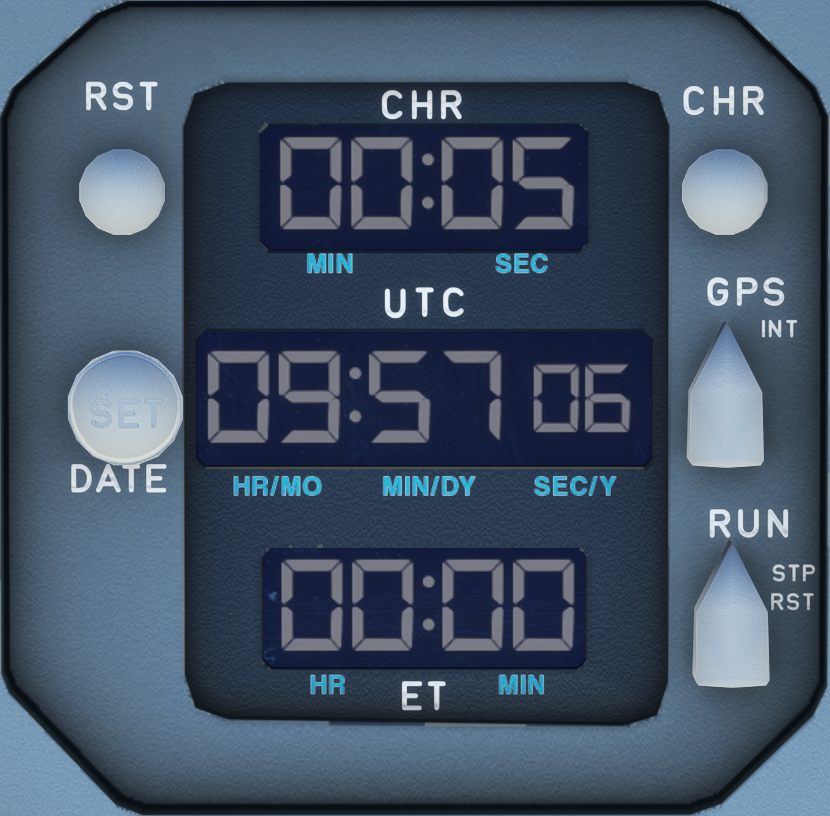

---
hide:
    - navigation
---

# Clock

---

[Back to Flight Deck](../flight-deck.md){ .md-button }

---

{width=50%}

## Description

A fully independent clock is on the right side of the control panel.
It sends time to the centralized fault data interface unit, the flight data interface unit, and the flight management and guidance computer.

The clock has two electrical supplies, one of which is a direct connection to the aircraft battery hot bus.

The clock performs four functions :

- It displays "UTC" (GMT) time in hours, minutes and seconds on the center counter.
- It displays elapsed time (ET) (from engine startup) in hours and minutes on the lower counter.
- It drives the chronometer (CHR), which measures a time interval (from the pushing of the CHRONO button) in minutes and seconds.
- It can replace the UTC with the date.

## Usage

### UTC (GMT) counter

This counter displays the present time in 24-hour format from O to 23 hours 59 minutes 59 seconds.

### Elapsed Time (ET) counter

This counter registers the aircraft's flight time from O to 99 hours 59 minutes.

### Chrono (CHR) counter

This counter registers elapsed time from O to 99 minutes 59 seconds. It is controlled by the CHR pushbutton.

###  CHR pushbuttonFirst push starts the CHR counter

Second push : stops the CHR counter, keeps the display at its last indication.

### Reset (RST) pushbutton

When pressed, the CHR counter restarts from O if the chrono is running.

### ET selector

- RUN: the ET counter starts
- STP: the ET counter stops counting
- RST: spring loaded - the ET counter is blanked. The selector returns to its STP position when the selector is released.

Note : A cumulative elapsed time can be realized by alternatively setting this switch in "RUN" and "STP" position.

### DATE/SET button

First push sets the clock to date mode. The UTC time display is replaced by the date (day month year).

Second push sets the clock to time mode. The date display disappears.

Note : in order to select the date mode, the UTC selector must be set on "GPS" or "INT" position.

---

[Back to Flight Deck](../flight-deck.md){ .md-button }
