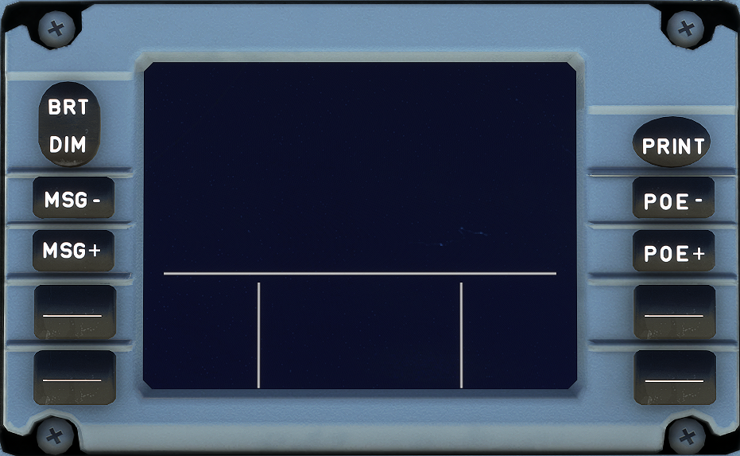

---
hide:
    - navigation
---

# Datalink Ctl and Display Unit

---

[Back to Flight Deck](../index.md){ .md-button }

---

{width=50%}

## Description

The Datalink Ctl and Display Unit (DCDU) is used by the pilots to communicate with Air Traffic Control (ATC) by the means of text messages instead of voice radio.

In addition to the DCDU, the MCDU is used to prepare a request.

The DCDU is not implemented in the FlyByWire A32NX. For additional information please refer to the Flight Crew Operating Manual (FCOM) as this system would go beyond this briefing.

---

[Back to Flight Deck](../index.md){ .md-button }
