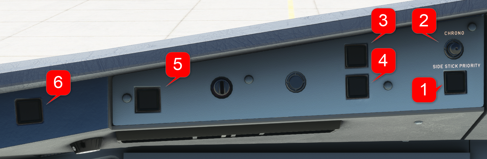

---
hide:
    - navigation
---

# Warning Panel

---

[Back to Flight Deck](../flight-deck.md){ .md-button }

---

### Usage

#### 1. SIDE STICK PRIORITY Lt

- Red arrow light:
    - comes on in front of the pilot losing authority.
    - goes out if he has recovered his authority
        - if the other pilot releases his TAKEOVER pushbutton prior the priority condition is latched or
        - If he has used his takeover push button to cancel a latched priority situation. 
         **Sidestick priority audio***: A "PRIORITY LEFT" or "PRIORITY RIGHT" audio voice message is given each time priority is taken.

- Green CAPT and F/O lights :
    - Both lights flash when the pilots move both sidesticks simultaneously and neither takes priority.
    - When a pilot has taken priority by pressing the takeover pushbutton and the other pilot's sidestick is not at neutral, the light in front of the pilot with priority lights up. It goes out when the other pilot returns his stick to the neutral position.

#### 2. CHRONO Pushbutton

- Pushing this button displays chronometer time on the onside ND.
- Pushing it again freezes the displayed value.
- Pushing it a third time resets the chronometer, and the chronometer time disappears from the display.

#### 3. MASTER WARN

- Flash red for level 3 warning.
- Accompanied by an aural warning (continuous repetitive chime, specific sounds or synthetic voice).

#### 4. MASTER CAUT

- Light up steady amber for a level 2 caution.
- Accompanied by a single chime.

These lights go out when:

- One pilot presses the light (except for some red warnings, such as the overspeed and stall warnings).
- The warning/caution situation is over.
- The pilot presses the CLR pushbutton on the ECAM control panel (except for some red warnings, such as the overspeed and stall warnings).
- The pilot presses the EMER CANC pushbutton on the ECAM control panel.

The aural warnings cease when:

- One pilot presses the MASTER WARN light (except for some red warnings, such as the overspeed and stall warnings).
- The warning situation is over.
- The pilot presses the EMER CANC pushbutton on the ECAM control panel.

#### 5.  AUTOLAND WARNING LIGHT

- The following situations, when occurring below 200 feet RA, with the aircraft in LAND mode, trigger the flashing AUTOLAND red warning and a triple click aural warning:

    - Both APs OFF below 200 feet RA
    - Excessive deviation in LDC (1/4 dot above 15 feet RA) or GLIDE (1 dot above 100 feet RA) In addition, LDC and GLIDE scales flash on the PFD.
    - Loss of LDC signal above 15 feet, or loss of GLIDE signal above 100 feet. The FD bars flash on the PFD. The LAND mode remains engaged.
    - The difference between both radio altimeter indications is greater than 15 feet.

#### 6. ATC MSG

- Flashes when an ATC message is received over CPDLC (Controller-Pilot Data Link Communication), along with an alarm. The notification can be cancelled by either pressing the “ATC MSG” button or replying to the instruction on the DCDU.

---

[Back to Flight Deck](../flight-deck.md){ .md-button }

