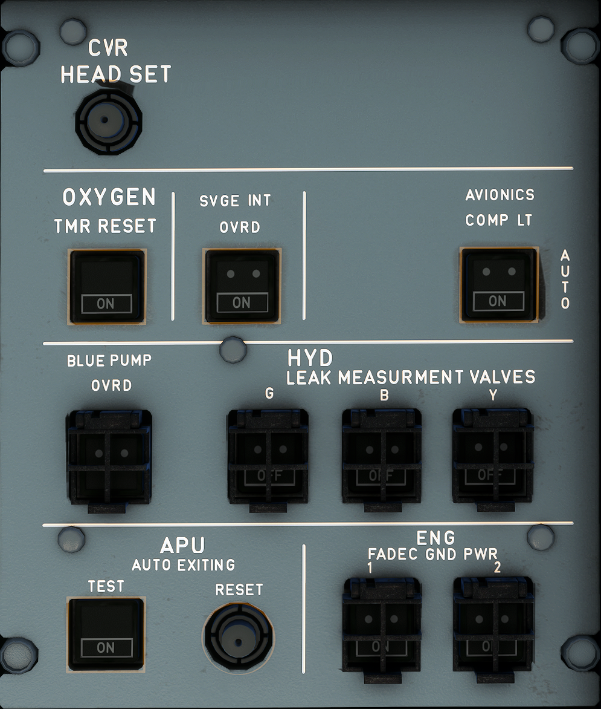

---
hide:
    - navigation
---

# Maintenance Panel

---

[Back to Flight Deck](../flight-deck.md){ .md-button }

---

---
## Usage

### CVR Headset

Headphone output to monitor the Cockpit Voice Recorder, e.g., for testing.

### OXYGEN TMR RESET pushbutton

The maintenance crew uses this pushbutton to reset the control circuit, after the system has operated.

- ON: The PASSENGER SYS ON light goes off.
- FAULT: This light comes on in white, when the door latch solenoids are energized for more than 30s.

### SVCE INT OVRD pushbutton switch

- Auto: Ground personnel can communicate with the flight crew by means of the service interphone jacks 10s after the aircraft has landed. The landing gear must be compressed.
- ON: Communication is possible when the landing gear is not compressed.
The ON light is white.

### AVIONICS COMP LT pushbutton switch

- AUTO: avionic compartment lighting is automatically controlled by door opening
- ON: avionic compartment lighting is on

### BLUE PUMP OVRD pushbutton switch (guarded).

- ON: The blue electric pump is on if the ELEC PUMP pushbutton switch on the HYD panel is at AUTO.
- OFF: The blue electric pump is off.

### HYD LEAK MEASUREMENT VALVES pushbutton switch (guarded).

- OFF: The corresponding electrohydraulic valve closes and shuts off hydraulic supply to the primary flight controls.
- ON: The corresponding electrohydraulic valve opens to go back to normal hydraulic supply.

### APU

- TEST PB-SW: When pressed, tests the following APU circuits:
    - Fire warning
    - Auto extinguishing
    - Shutdown.

    During the test sequence, the APU MASTER sw must be ON.
    If all circuits are operating correctly, the OK light comes on.

    Note: If the APU was running, it shuts down.

- RESET PB: When pressed, resets the test circuit.

### ENG FADEC GND PWR pushbutton switches

- OFF: The electrical network of the aircraft or the FADEC alternator automatically supplies the FADEC.
- ON: On ground, when pressed the electrical network of the aircraft supplies the FADEC when:
    - The ENG FIRE pb-sw is not pressed,
    - The FADEC alternator does not supply the FADEC.

---

[Back to Flight Deck](../flight-deck.md){ .md-button }
