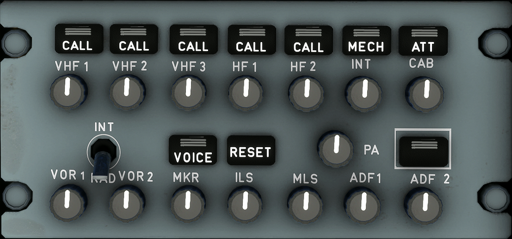
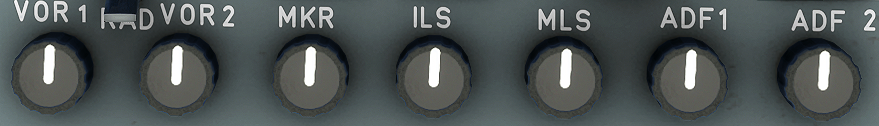

---
hide:
    - navigation
---

# 3rd Audio Control Panel

---

[Back to Flight Deck](../flight-deck.md){ .md-button }

---

## Usage

### Tansmission Keys

- Pressed:
    - The associated channel is selected for transmission.
    - The three green lines come on.
    - The pilot deselects the channel by pressing the pushbutton again, or by selecting another channel.
- CALL:
    - The legend flashes amber (and buzzer sounds) when the SELCAL system detects a call.
- MECH:
    - The legend flashes amber (and buzzer sounds) for a call from the nose gear bay. The MECH light goes off after 60 seconds, if it is not reset.
- ATT:
    - The legend flashes amber (and buzzer sounds) for a call from a cabin attendant. The ATT light goes off after 60 seconds, if it is not reset.

### Reception Knobs

These knobs allow the flight crew to select reception channels and to adjust their volume.

- Pressing and releasing the knob (knob out) selects the associated audio reception channel. The integral white light comes on. Rotating the knob adjusts the volume.
- Pressing the knob (knob stays in) disconnects the associated audio reception channel.

Note : For reception of DME audio navigation signals associated to an ILS or MLS station, the ILS (or LS) pushbutton on the FCU must also be selected.

### RESET

Pressing this key extinguishes CALL, MECH, and ATT lights.

### VOICE

This key allows the flight crew to inhibit the audio navigation signals (VOR, ADF). Pressing this key filters out ident signals and turns on the green ON light.

### INT/RAD

This switch operates as a press-to-talk switch for boom mike or oxygen mask mike.

- INT:
    - Boom and mask mikes transmit on interphone regardless of which transmission key is selected. For reception on interphone, the crew member must have INT selected (INT reception knob out).
- Neutral:
    - Reception is normal. Boom and mask mikes do not transmit.
- RAD (press and hold):
    - Boom and mask mikes transmit on the radio selected on the audio control panel.

### PA (Passenger Address)

The passenger address allows flight personnel to make announcements to passengers in the cabin through loudspeakers. It can be operated from the cockpit (with ACP or handset) or from the cabin (attendant stations).

#### PA transmission key

Pressed and held: The flight crew may use a boom, mask, or hand mike to make an announcement. Three green lines come on.

Note : The flight crew may use a cockpit handset to make PA announcements without action on the ACPs.

#### PA reception knob

- Pressed and released (knob out):
    - The message goes to the loudspeakers and the integral white light comes on. The flight crew can rotate the knob to adjust the volume.
- Pressed (knob in):
    - The PA system is disconnected. The white light goes out.

---

[Back to Flight Deck](../flight-deck.md){ .md-button }
