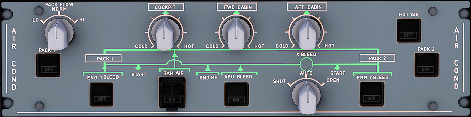

---
hide:
    - navigation
---

# Air Condition Control Panel

---

[Back to Flight Deck](../flight-deck.md){ .md-button }

---

## Description

The air conditioning system operation is fully automatic.

It provides a continual renewal of air and maintains a constant selected temperature in the three following zones : COCKPIT, FWD CABIN, AFT CABIN which are independently controlled.

The air is supplied by the pneumatic system, via:

- two pack flow control valves
- two packs
- the mixing unit, which mixes the air coming from the cabin and from the packs.

It is then distributed to the cockpit and the cabin.
The temperature regulation is optimized through the hot air pressure regulating valve and the trim air valves which add hot air tapped upstream of the packs to the mixing unit air.
In an emergency, a ram air inlet can provide ambient air to the mixing unit.
The temperature regulation is controlled by a zone controller and two pack controllers.
Flight deck and cabin temperature can be selected from the AIR CON □ panel in the cockpit.
Low pressure air is supplied to the mixing unit by a ground connection.

The two air conditioning packs operate automatically and independently of each other. Pack operation is controlled by pack controller signals.
Warm pre-conditioned bleed air enters the cooling path via the pack valve and is ducted to the primary heat exchanger.
Then the cooled bleed air enters the compressor section of the air-cycle machine and is compressed to a higher pressure and temperature.
It is cooled again in the main heat exchanger and enters the turbine section, where it expands and in expanding generates power to drive the compressor and cooling air fan.
The removal of energy during this process reduces the temperature of the air, resulting in very low air temperature at turbine discharge.

## Usage

### COCKPIT, FWD CABIN, AFT CABIN

- 12 o'clock position : 24°C (76°F).
- COLD position : 18°C (64°F).
- HOT position : 30°C (86°F).

### HOT AIR

- ON: The valve regulates hot air pressure.
- OFF: The valve closes, and the trim air valves close. The FAULT circuit is reset.
- FAULT: The amber light, and associated ECAM caution come on when duct overheat is detected. The fault circuit detects an overheat when the duct R temperature reaches 88°C ( 190°F). The valve and the trim air valves close automatically. The FAULT light goes off when the temperature drops below 70°C (158°F), and the flight crew selects OFF.

### PACK 1 + 2

- ON: The pack flow control valve is automatically controlled.
    It opens, except in the following cases :
    - Upstream pressure below minimum ;
    - Compressor outlet overheat ;
    - Engine start sequence :
        1. If the crossbleed valve is closed, the valve located on the starting engine side immediately closes, when the MODE selector is set to IGN (or CRK).
        2. It remains closed on the starting engine side (provided the crossbleed valve is closed) when:
            - The MASTER switch is set to ON (or the MAN START pushbutton is set to ON), and
            - The start valve is open, and
            - N2 < 50 %.
      Note: If the crossbleed valve is open at engine start, both pack flow control valves close.
        3. On ground, reopening of the valves is delayed for 30 seconds to avoid a supplementary pack closure cycle during second engine start.
    - The fire pushbutton, of the engine on the related side, is pressed,
    - Ditching is selected.
- OFF: The pack flow control valve closes.
- FAULT: Comes on amber, and a caution appears on the ECAM, if the pack flow control valve position disagrees with the selected position, or in the case of compressor outlet overheat or pack outlet overheat.

### PACK FLOW selector

- Permits the selection of pack valve flow, according to the number of passengers and ambient conditions (smoke removal, hot or wet conditions). LO (80 %) - NORM (100 %) - HI (120 %).

- Manual selection is irrelevant in single pack operation, or with APU bleed supply. In these cases, HI is automatically selected.
- If LO is selected, the pack flow can be automatically selected up to 100 % when the cooling demand cannot be satisfied.

### RAM AIR (guarded)
- ON : The ON light comes on white.
    If the DITCHING pushbutton, on the CABIN PRESS panel, is in normal position :
    - The RAM air inlet opens.
    - If &#916;p >= 1 psi : The outflow valve control remains normal. No emergency RAM air flows in.
    - If &#916;p < 1 psi : The outflow valve opens to about 50 % when under automatic control. It does not automatically open when it is under manual control. Emergency RAM airflow is directly supplied to the mixer unit.
- OFF: The RAM air inlet closes.

### ENG 1 and ENG 2 BLEED

- ON: Bleed valve opens if:
    - Upstream pressure is above 8 psi.
    - APU BLEED pushbutton switch is off or APU bleed valve is closed.
    - There is no onside wing or pylon leak, and no overpressure or over temperature has been detected.
    - The ENG FIRE pushbutton has not been popped out.
    - The engine start valve is closed.
- FAULT: This amber light comes on, and an ECAM caution appears, if:
    - There is an overpressure downstream of the bleed valve.
    - There is a bleed air overheat.
    - There is a wing or engine leak on the related side.
    - The bleed valve is not closed during engine start.
    - The bleed valve is not closed with APU bleed ON.
    It goes out when the ENG BLEED pushbutton switch is OFF if the fault has disappeared.
- OFF: The bleed valve and HP valve close. The white OFF light comes on.

### APU BLEED

- ON: The APU valve opens if N > 95 % and there is no leak in the APU or in the left side bleed. (If there is a leak on the right side, the x-bleed valve closes.)
      The blue ON light comes on.
- OFF: The APU valve closes.
- FAULT: This amber light comes on, and an ECAM caution appears, when the system detects an APU leak.

### X-BLEED selector

- AUTO: The crossbleed valve is open if the APU bleed valve is open. The crossbleed valve is closed if the APU bleed valve is closed or, in case of a wing, pylon, or APU leak (except during engine start).
- OPEN: The crossbleed valve is open.
- CLOSE: The crossbleed valve is closed.

---

[Back to Flight Deck](../flight-deck.md){ .md-button }
