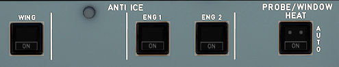

---
hide:
    - navigation
---

# Anti Ice Panel

---

[Back to Flight Deck](../index.md){ .md-button }

---

---

## Description

The ice protection system allows unrestricted operation of the aircraft in icing conditions.

ANTI-ICING

Either hot air or electrical heating protects critical areas of the aircraft as follows.

HOT AIR

- three outboard leading-edge slats of each wing.
- engine air intakes.

ELECTRICAL HEATING

- flight compartment windows.
- sensors, pitot probes and static ports.
- waste-water drain mast.

## Usage

### WING ANTI ICE

This switch controls the wing anti ice system on the left and right sides simultaneously.

- ON: It lights up blue.
    WING A. ICE appears on the ECAM MEMO page. 
    Wing anti ice control valves open if a pneumatic supply is available. 
    On the ground the wing anti-icing control valves open for 30 seconds only (test sequence). 
- OFF: ON light goes off. Wing anti-icing control valves close.
- FAULT: Amber light comes on, and caution appears on ECAM, if:
    - the position of the anti-icing control valve is not the required position, or
    - low pressure is detected. 
    Note : The amber FAULT light comes on briefly as the valves transit.

### ENG 1 + 2

- ON: light comes on blue. 
    ECAM MEMO displays "ENG A. ICE". 
    Engine anti-ice valve opens if bleed air is available from the engine. 
    Continuous ignition is selected when the valve is opened and the ANTI ICE ENG pushbutton switch is selected ON. This makes the IGNITION memo appear on the ECAM.
- OFF: ON light goes out. Engine anti-ice valve closes.
- FAULT: Amber light comes on, and caution message appears on ECAM, if the position of the anti-icing valve disagrees with the ENG 1 (2) pushbutton selection. 
   Note : The amber FAULT light comes on briefly as valve transits.

###  PROBE/WINDOW HEAT

- AUTO: Probes/Windows are heated automatically:
    - in flight or
    - on the ground (except TAT probes) provided one engine is running.
- ON: Probes and windows are heated permanently. Blue light comes on.

[Back to Flight Deck](../index.md){ .md-button }
