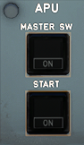

---
hide:
    - navigation
---

# Auxiliary Power Unit

---

[Back to Flight Deck](../index.md){ .md-button }

---

## Usage

### MASTER SW

This switch controls the electric power supply for APU operation, and its protective features. It also controls the starting and shutdown sequences.

- ON:
    - The blue ON light comes on. 
    - Electric power goes to the APU system ; the ECB performs a power-up test.
    - The APU air intake flap opens.
    - The APU fuel isolation valve opens.
    - If no fuel tank pump is running, the APU fuel pump operates.
    - If the aircraft has ground power or main generator power, th page appears on the ECAM display. 
- OFF:
    - Manual shutdown sequence.
    - The ON light on the MASTER SW pushbutton, and the AVAIL light on the START pushbutton, go off.
    - If the aircraft was using APU bleed air, the APU keeps running for a cooling period of 60 seconds.
    - At 7 %, the air inlet flap closes.
- FAULT Lt:
    - This amber light comes on, and a caution appears on the ECAM, when an automatic APU shutdown occurs, which happens in case of:
        - Fire (on ground only)
        - Reverse flow
        - Air inlet flap not open
        - Low oil pressure
        - Overspeed
        - High oil temperature
        - No acceleration
        - No speed
        - DC power loss. (BAT OFF when aircraft on batteries only)
        - EGT overtemperature
        - ECB failure
        - No flame
        - Loss of overspeed protection
        - Underspeed
        - Oil system shutdown
        - Inlet overheat
        - Clogged oil filter
        - Loss of EGT thermocouples

### START

- ON:
    - Blue ON light comes on.
    - When the flap is completely open, the starter is energized.
    - 1.5 second after the starter is energized, the ignition turns on.
    - When N = 60 %. The APU starter is de-energized. The ignition is turned off.
    - 2 seconds after N reached 95 %, or when N is above 99.5 % :
    The ON light on the START pushbutton goes out.
    The APU may now supply bleed air and electrical power to the aircraft
    systems.
    - 10 seconds later, the APU page disappears from the ECAM display.
- AVAIL Lt:
    - This green light comes on when N is above 99.5 % or 2 seconds after N reaches 95 %.

---

[Back to Flight Deck](../index.md){ .md-button }
