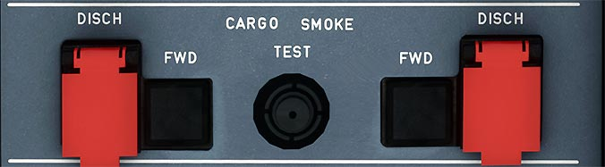

---
hide:
    - navigation
---

# Cargo Smoke Panel

---

[Back to Flight Deck](../index.md){ .md-button }

---

## Usage

### SMOKE light

This red light, and the associated ECAM warning, come on when the system detects smoke in the indicated compartment. This light comes on, if:

- Both channels detect smoke, or
- One channel detects smoke and the SDCU finds that the other channel is faulty.

### DISCH pushbutton

This button ignites the squib to discharge the extinguishing agent in the corresponding compartment (FWD or AFT).

### DISCH light
R Within 60 seconds after pressing the discharge pushbutton, this amber light comes on,thereby indicating that the agent bottle has fully discharged.

### TEST pushbutton

Pressing this button for at least 3 seconds, and until it is released:

- Tests the smoke detectors in sequence,
- Turns on the red smoke lights twice, and displays the ECAM warning,
- Closes the ventilation system's isolation valves.
- Turns on the amber DISCH lights.

---

[Back to Flight Deck](../index.md){ .md-button }
