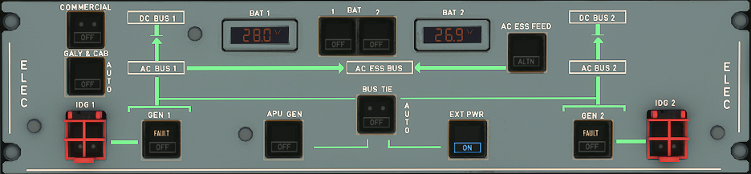
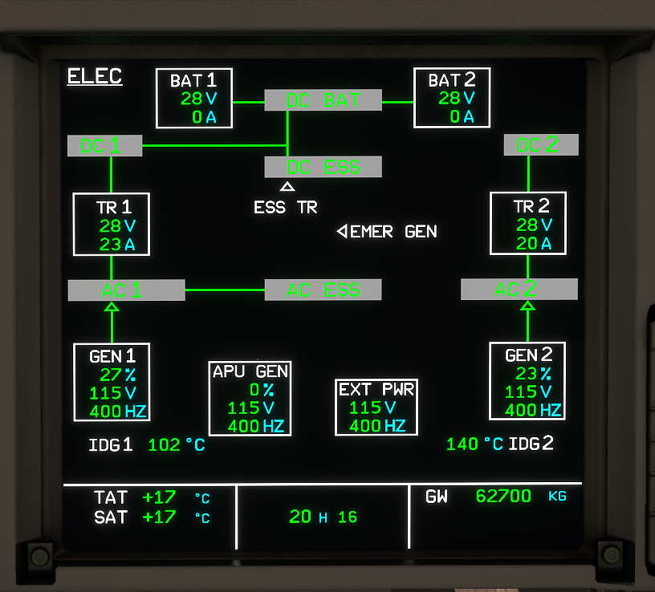

---
hide:
    - navigation
---

# Electrical System Control Panel

---

[Back to Flight Deck](../index.md){ .md-button }

---

## Description

The A320neo's electrical system is automatic for most normal operations. There is only very little crew interaction of input required.

When the overhead electrical panel has all switches on AUTO (no lights visible) the only required manual input is the "EXT PWR" button to connect ground power to the aircraft.

- GEN 1 and 2 when operating have priority over the APU generator and over external power.
- External power has priority over the APU generator when the EXT PWR pushbutton switch is ON.
- The APU generator or external power can supply the entire network.
- One engine generator can supply the entire network.

## Usage

### BAT 1 + 2

The BAT 1+2 Indicators display the current voltage of the respective battery. Normal values are 25 to 31 Volts and these are displayed in green. Outside of these "normal" values the values will be displayed in amber.

The BAT 1+2 pushbutton switches control the operation of the corresponding battery charge limiter.

- AUTO: The battery charge limiter controls automatically the connection and the disconnection of the corresponding battery to the DC BAT BUS (3 PP) by closing and opening of the battery line contactor.
    - The batteries are connected to the DC BAT BUS in the following cases :
        - APU starting (MASTER SW at ON and N < 95%).
        - Battery voltage below 26.5 V (battery charge).
        - Loss of AC BUS 1 and 2 when below 100 knots (EMER GEN not supplying).
    - If AC BUS 1 and 2 are not energized and emergency generator is not
  supplying:
        - battery 1 supplies the AC STAT INV BUS, and, if speed is greater than 50 kt, the AC ESS BUS.
        - battery 2 supplies the DC ESS BUS.
- OFF: The battery charge limiter is not operating : the battery line contactor is open. OFF comes on white if the DC BAT BUS is supplied. Hot buses remain supplied.
- FAULT: Comes on amber, accompanied by an ECAM caution, when the charging current for the corresponding battery is outside limits. In this case the battery contactor opens.

### EXT PWR

AVAIL light comes on green if:

- external power is plugged in, and
- external power parameters are normal.

When pressed:

- If the AVAIL light was on :
    - The external power line contactor closes.
    - The AVAIL light goes off.
    - The ON light comes on blue.
- If the ON light was on :
    - The external power line contactor opens.
    - The ON light goes off.
    - The AVAIL light comes on.

Note:

1. External power has priority over the APU generator. The engine generators have priority over external power.
2. The ON light stays on even when the engine generators supply the aircraft.

### APU GEN

- ON: The APU generator field is energized and the line contactor closes if parameters are normal and the EXT PWR line contactor is open. The bus tie contactor 1 (2) closes automatically if GEN 1 (2) is not operating.
- OFF: The generator field is de-energized and the line contactor opens. The fault circuit is reset.
- FAULT: Same as GEN 1 or 2 FAULT. 
    The APU GEN FAULT light is inhibited when APU speed is too low or if the APU GEN line contactor opens after EXT PWR or ENG GEN takes over.

### GEN 1 + 2

- ON: The generator field is energized and the line contactor closes if electrical parameters are normal.
- OFF: The generator field is de-energized and the line contactors opens. The fault circuit is reset.
- FAULT: Lights up amber, and an ECAM caution comes on, if :
    - The associated generator control unit (GCU) trips it.
    - Opening of the line contactor (except if the GEN pushbutton switch is selected OFF)

### BUS TIE

- AUTO: The bus tie contators (BTCs) open or close automatically in order to maintain power supply to both AC BUS 1 and AC BUS 2.
    - One contactor is closed when :
        - One engine generator supplies the associated AC BUS, and
        - The APU generator or external power supplies the other side.
    - Both contactors are closed during single-engine operation, or operation on the APU generator or external power supply.
- OFF: Both bus tie contactors open. When set to OFF the AC buses are isolated from each other and only power from the engine generators are supplying the respective AC buses. (TODO: Is this correct?? BUS TIE off ==> no APU or Ext Pwr))

### AC ESS FEED

The AC ESS BUS (ESS = essential) is normally supplied from AC BUS 1.

It may be supplied by AC BUS 2 through the AC ESS FEED pushbutton switch.

- NORMAL: The AC ESS BUS is supplied from AC BUS 1.
- ALTN: The AC ESS BUS is supplied from AC BUS 2.
- FAULT : Comes on amber, and ECAM caution comes on, when the AC ESS BUS is not electrically supplied.

Note : In case of total loss of main generators, the AC ESS BUS is automatically supplied by the emergency generator, or by the static inverter if the emergency generator is not available.

### IDG 1 + 2

The IDG switches are normally spring loaded out. Pressing this switch disconnects the IDG from its driveshaft only maintenance personnel can reconnect it.

- FAULT: Lights up amber, and ECAM caution comes on, if :
    - IDG oil outlet overheats (above 185°C), or
    - IDG oil pressure is low (inhibited at low engine speed : N2 below 14 %). It extinguishes when the IDG is disconnected.

### GALY & CAB

- AUTO: Main galley, secondary galley and in-seat power supply are supplied. The main galley and in-seat power supply are shed automatically when:
    - In flight: only one generator is operating.
    - On the ground: only one engine generator is operating. (All galleys are available when the APU GEN or EXT PWR is supplying power.)
- OFF: The main galley, secondary galley and in-seat power supply /41 are not supplied.
- FAULT: Comes on amber, and ECAM caution comes on, when the load on any generator is more than 100 % of rated output.

### COMMERCIAL

- ON: All aircraft commercial electrical loads are supplied :
    - cabin and cargo lights
    - water and toilet system
    - drain mast ice protection
    - galley
    - passengers' entertainment
    - semi-automatic cargo loading (if installed)
- OFF: Switches off all aircraft commercial electrical loads.

## ECAM ELEC page

---

[Back to Flight Deck](../index.md){ .md-button }
