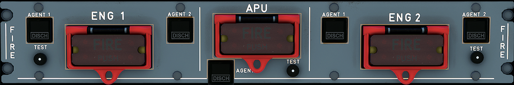

---
hide:
    - navigation
---

# Fire Control Panel

---

[Back to Flight Deck](../flight-deck.md){ .md-button }

---

## Description

The engines and the APU each have a fire and overheat detection system consisting of:

- Two identical gas detection loops (A and B) mounted in parallel.
- A Fire Detection Unit (FDU).

The gas detection loops consist of :

- Three sensing elements for each engine, one in the pylon nacelle, one in the engine core and one in the engine fan section.
- One sensing element in the APU compartment.

When a sensing element is subjected to heat, it sends a signal to the fire detection unit. As soon as loops A and B detect temperature at a preset level, they trigger the fire warning system.

A fault in one loop (break or loss of electrical supply) does not affect the warning system. The unaffected loop still protects the aircraft.

If the system detects an APU fire while the aircraft is on the ground, it shuts down the APU automatically and discharges extinguishing agent.

## Usage

### ENG 1 + 2 FIRE pushbutton

This pushbutton's normal position is in, and guarded.

The pilot pushes it to release it. It pops out, sending an electrical signal that performs the following for the corresponding engine :

- Silences the aural fire warning
- Arms the fire extinguisher squibs
- Closes the low-pressure fuel valve
- Closes the hydraulic fire shut off valve
- Closes the engine bleed valve
- Closes the pack flow control valve
- Cuts off the FADEC power supply
- Deactivates the IDG

### ENG 1 + 2 FIRE light

This red light comes on, regardless of the pushbutton's position, whenever the fire warning for the corresponding engine is activated.

### ENG 1 + 2 AGENT 1 + 2

Both of these buttons become active when the flight crew pops the ENG FIRE button for their engine.

A brief push on the button discharges the corresponding fire bottle.

- "SQUIB" lights up white when the flight crew pops the ENG FIRE button for its engine to help the flight crew identify the AGENT pushbutton to be activated.
- "DISCH" lights up amber when its fire extinguisher bottle has lost pressure.

### ENG 1 + 2 TEST

This button permits the flight crew to test the operation of the fire detection and extinguishing system.

- When the flight crew presses it:
    - A continuous repetitive chime sounds.
    - The MASTER WARN lights flash.
    - ENG FIRE warning appears on ECAM.
    - On the FIRE panel :
        - The ENG FIRE pushbutton lights up red.
        - The SQUIB lights come on white if discharge supplies are available.
        - The DISCH lights come on amber.
    - On the ENG panel (pedestal) :
        - The FIRE lights come on red.

### APU FIRE pushbutton

This switch's normal position is in and guarded.

The pilot pushes it to release it. It pops out, sending an electrical signal that performs the following for the APU :

- shuts down the APU
- silences the aural warning
- arms the squib on the APU fire extinguisher
- closes the low-pressure fuel valve
- shuts off the APU fuel pump
- closes the APU bleed valve and X bleed valve and deactivates the APU generator.

The red APU FIRE light comes when the APU fire warning is activated, regardless of the position of the pushbutton.

### APU AGENT

This button becomes active when the pilot pops the APU FIRE button.

The flight crew presses it briefly to discharge the fire bottle.

- SQUIB lights up white when the pilot pops the APU FIRE button.
- DISCH lights up amber on when the fire extinguisher bottle has lost pressure.

Note : A red disk, which is outside at the rear of the fuselage, signals that the agent is not discharged overboard due to bottle overpressure.

### APU TEST

This button permits the flight crew to test the operation of the fire detection and extinguishing system for the APU.

- When the flight crew presses it :
- A continuous repetitive chime sounds.
- The MASTER WARN lights flash.
- APU FIRE warning appears on ECAM.
- On the APU FIRE panel :
    - The APU FIRE pushbutton lights up red.
    - The SQUIB light comes on white.
    - The DISCH light comes on amber.

Note : The automatic shutdown of the APU on the ground will not occur while the flight crew is performing this test.

---

[Back to Flight Deck](../flight-deck.md){ .md-button }
