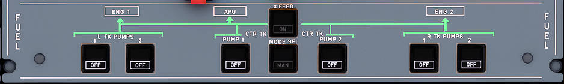

---
hide:
    - navigation
---

# Fuel Control Panel

---

[Back to Flight Deck](../index.md){ .md-button }

---

## Description

Total Fuel Capacity:

- Two outer tanks: 1,760 liters (1,408kg)
- Two inner tanks: 13,849 liters (11,079kg)
- One center tank: 8,250 liters (6,600kg)

The tanks empty in the following sequence :

1. center tank
2. inner tanks (down to 750 kg in each inner tank)
3. outer tanks (fuel transferred into the inner tanks)

In normal operation each engine is supplied by one pump in the center tank or two pumps in its own side wing tank. All wing tank pumps remain on throughout the flight. They are fitted with pressure relief sequence valves which ensure that, when all pumps are running, the center tank pumps will deliver fuel preferentially.

Two electrical transfer valves are mounted in each wing to permit fuel transfer from outer to inner tank.

A cross feed valve controlled by a double motor allows both engines to be fed from one side or one engine to be fed from both sides.

## Usage

###  L + R TK PUMPS 1 + 2

- ON: Pump is on but fuel feeds only when center tank pumps delivery
pressure drops below threshold.
- OFF: Pump is OFF and OFF button lights up white.
- FAULT: Amber light comes on, and ECAM caution comes on, when the delivery pressure drops. It does not come on when OFF is selected.

### MODE SEL

- AUTO: Control of center tank pumps is automatic.
    - They run at engine start for 2 minutes.
    - Before or after engine start sequence, the pumps run if the slats are retracted.
    - They stop automatically 5 minutes after center tank low level is reached.
- MAN: Flight crew controls the center tank pumps manually with center tank pumps pushbutton switches.
- FAULT: Amber light comes on, and ECAM caution comes on when center tank has more than 250 kg (550 lb) of fuel and the left or right wing tank has less than 5000 kg (11000 lb).

### CTR TK PUMP 1 + 2

- ON: Pump runs if MAN mode is selected on MODE SEL pushbutton switch. Pump is automatically controlled when AUTO mode is selected.
- OFF: Pump is OFF and OFF button lights up white.
- FAULT: Amber light comes on, associated with ECAM caution, when the pump is in operation and the delivery pressure drops.

### X FEED

- OFF: Valve closes and button does not light up.
- ON: Valve opens and ON button lights up white.
- OPEN: This green light comes on when the valve is fully open.

---

[Back to Flight Deck](../index.md){ .md-button }

