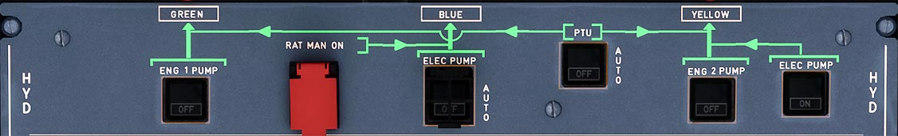

---
hide:
    - navigation
---

# Hydraulics Control Panel

---

[Back to Flight Deck](../index.md){ .md-button }

---

## Description

The aircraft has three fully independent systems: Green, Yellow, Blue.

Normal operation functioning description:

- Green and Yellow system are pressurized by an engine-driven pump (one pump for each system)
- Blue system is pressurized by an electric pump

Abnormal operation description:

- If engine No. 1 is inoperative or Green pump has failed:
    - The Green system is pressurized by the reversible Power Transfer Unit (PTU)
- If engine No. 2 is inoperative or Yellow pump has failed:
    - The Yellow system is pressurized by the reversible PTU
- In case of dual engine failure or total electrical power loss:
    - The Ram Air Turbine (RAT) will pressurize the Blue system.

On ground:

- Blue and Yellow systems can be pressurized by electric pumps. A handpump (operated from the ground on the yellow system) facilitates manoeuvring of the cargo doors.
- Green/Yellow system can be pressurized by the PTU.

## Usage

###  ENG 1 + 2 PUMP

- ON: The pump pressurizes the system when the engine is running.
- OFF: The pump is depressurized. The generation of hydraulic power stops.
- FAULT: This amber light comes on, and the ECAM caution appears, if:
    - The reservoir level is low
    - The reservoir overheats
    - The reservoir air pressure is low
    - The pump pressure is low (inhibited on the ground, when the engine is stopped). This light goes out, when the crew selects OFF, except during an overheat. (The light stays on as long as the overheat lasts).

### BLUE ELEC PUMP

- AUTO: If AC power is available, the electric pump operates:
    - In flight
    - On the ground, if one engine is running or if the crew has pressed the BLUE PUMP OVRD pushbutton on the maintenance panel.
-OFF: The pump is de-energized.
-FAULT: This amber light comes on, and a caution appears on the ECAM, if:
    - The reservoir level is low
    - The reservoir overheats
    - The air pressure in the reservoir is low
    - The pump is delivering low pressure (inhibited on the ground, when the engines are stopped)
    - The pump overheats.

The light goes out, when the crew selects OFF, except during an overheat. (The light stays on as long as the overheat lasts).

### YELLOW ELEC PUMP

- ON: The electric pump is ON. If the electrical power supply is removed, the pump will remain off when electrical power is applied again.
- OFF: The pump is off. It comes on automatically when a crewman sets the lever of the cargo door manual selector valve to OPEN or CLOSE. This inhibits the operation of other yellow system functions (except alternate braking and engine 2 reverse).
- FAULT It This amber light, accompanied by an ECAM caution, comes on if:
    - the reservoir level is low
    - air pressure in the reservoir is low
    - the reservoir overheats
    - pump pressure is low
    - the pump overheats.

The light goes out when the crew selects OFF, except during an overheat. (The light stays on as long as the overheat lasts).

### PTU

- AUTO: The bidirectional power transfer unit is armed and both the yellow and the green electrohydraulic valves are open. The power transfer unit runs automatically when the differential pressure between the green and yellow systems is more than 500 PSI. 
    Note : The PTU is inhibited during the first engine start and automatically tested during the second engine start.
- OFF: Both the green and the yellow PTU electrohydraulic valves close. Power transfer stops.
- FAULT: This amber light comes on, and a caution appears on the ECAM, if:
    - the green or the yellow reservoir overheats
    - the green or the yellow reservoir has low air pressure
    - the green or the yellow reservoir has a low flluid level.

The light goes out when the crew selects OFF, except during an overheat. (The light stays on as long as the overheat lasts).

### RAT MAN ON

The flight crew may extend the RAT at any time by pressing the RAT MAN ON
pushbutton.

Note: The RAT extends automatically if AC BUS 1 and AC BUS 2 are Jost.

---

[Back to Flight Deck](../index.md){ .md-button }

