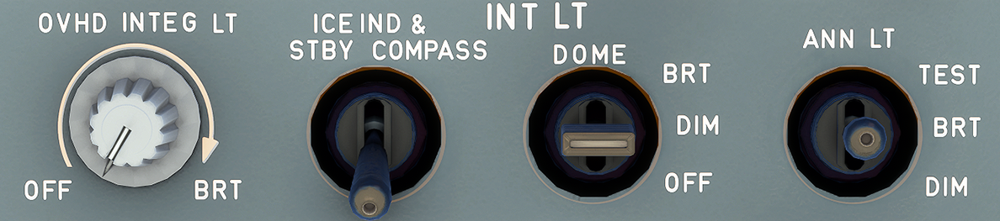

---
hide:
    - navigation
---

# Internal Lights Panel

---

[Back to Flight Deck](../flight-deck.md){ .md-button }

---

## Usage

### OVHD INTEG LT

This knob turns the integral lighting for the overhead panel on and off and adjusts its brightness.

### ICE IND & STBY COMPASS

This switch turns the integral lighting for the standby compass and the visual indicator on and off.

### DOME

This switch controls both dome lights.

- BRT: Both dome lights on bright.
- DIM: Both dome lights on dim.
- OFF: Both dome lights off.

### ANN LT
This switch sets the brightness of all the cockpit annunciator lights at either "bright" or "dim", and also tests them.

- TEST: Illuminates all flight deck annunciator lights. Puts 8's up in all liquid crystal displays (LCDs).
- DIM: Reduces voltage to all annunciator lights.
- BRT: Allows annunciators to function normally.

Note : Transfer of data between ECAM and the ND and switching between the
electronic instrument system and the display management computer are not
allowed during the ANN LT test.

---

[Back to Flight Deck](../flight-deck.md){ .md-button }

