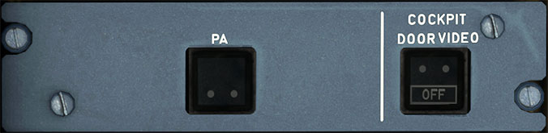

# PA and Cockpit Video

---

[Back to Flight Deck](../index.md){ .md-button }

---

## Usage

### PA in use Light

Illuminates when the PA is activated from the cockpit or the cabin (cabin attendant ot prerecorded announcement).

### Cockpit Door Video

- OFF:
    - Manually turns off the power for the Cockpit Door Surveillance System.

---

[Back to Flight Deck](../index.md){ .md-button }

