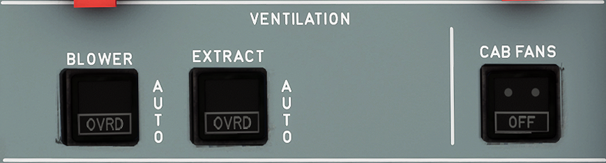

---
hide:
    - navigation
---

# Ventilation Panel

---

[Back to Flight Deck](../flight-deck.md){ .md-button }

---

## Usage

### BLOWER and EXTRACT

- AUTO:
    - When both pushbutton switches are on AUTO:
    - On the ground before the application of TO power, the ventilation system is in open circuit configuration (closed configuration when the skin temperature is below the ground threshold).
    - On the ground after the application of TO power, and in flight, the ventilation system is in closed circuit configuration.
- OVRD:
    - When either pushbutton switch is on OVRD:
        - The system goes to closed circuit configuration.
        - Air from the air conditioning system is added to ventilation air. (The blower fan stops if the BLOWER pushbutton switch is in the OVRD position).
    - When both pushbutton switches are on OVRD:
        - Air flows from the air conditioning system and then overboard.
        - The extract fan continues to run.
- FAULT It:
    - Lights up amber (and ECAM activates) in the blower switch, if:
        - blowing pressure is low*
        - duct overheats*
        - computer power supply fails
        - smoke warning is activated in the extract switch, if:
            - extract pressure is low*
            - computer power supply fails
            - smoke warning is activated.

* If the warning occurs on the ground when the engines are stopped,
the external horn sounds.

### CAB FAN pushbutton

- ON: The two cabin fans are on.
- OFF: The two cabin fans are off.

---

[Back to Flight Deck](../flight-deck.md){ .md-button }
