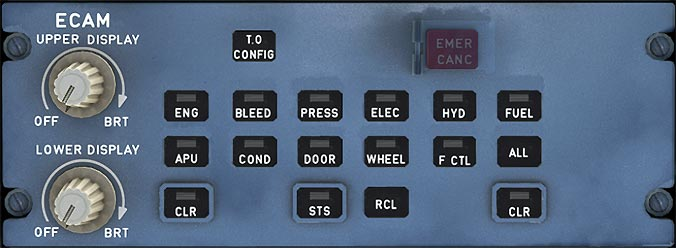

---
hide:
    - navigation
---

# ECAM Control Panel

---

[Back to Flight Deck](../index.md){ .md-button }

---

## Description

The ECAM Control Panel is used to change what is displayed on the Warning Display and System Display (Lower ECAM) and also has knobs to regulate brightness of the both ECAM displays.

<!-- TODO: UPDATE -->
!!! info "Future Update"
    A more in depth description of the ECAM is currently developed and will be available in the near future.

## Usage

###  OFF / BRT knobs

Used to turn the ECAM DUs on and off, and to control their brightness (automatic adjustment of brightness for ambient light conditions is superimposed on this manual control).

Note: When the pilot turns the UPPER DISPLAY knob to OFF, the engine/warning (E/W) display appears on the lower display unit (automatic transfer).

### System page pushbuttons

- Call up the corresponding system pages on the SD.
- Light up, when pushed for manual selection, or when an advisory is detected.
- Call up the aircraft system page corresponding to the present flight phase or the current warning when pushed a second time. When only one ECAM display is on, the pilot can display a system page for up to 3
minutes by pushing and holding the system page pushbutton.
    - If an advisory condition arises, the relevant system page is not automatically displayed, but the pushbutton light pulses.
    - If an ECAM warning is triggered, the relevant system page is not automatically displayed, and the system page pushbutton does not light up.

### RCL pushbutton

The pilot pushes the RCL pushbutton to call up the warning messages, the caution messages, and the status page, that may have been suppressed by the activation of the   CLR pushbutton or by flight-phase-related inhibition.

If there are no suppressed warnings or cautions, the E/WD shows "NORMAL'' for five seconds.

If the pilot holds this pushbutton down for more than three seconds, the E/WD displays any caution messages that were suppressed by the EMER CANC pushbutton.

### STS (status) pushbutton

The pilot pushes this pushbutton to display the STATUS page on the lower SD. The pushbutton remains lit, as long as the SD displays the STS page. If the system has no status messages, the status page displays "NORMAL" for five seconds.

The pilot can clear the STATUS page by pushing the CLR pushbutton, or by pushing the STS pushbutton a second time.

When only one ECAM display is on :

- It displays the STATUS page only when the pilot pushes the STATUS pushbutton and holds it. He can display the next STATUS page, if any, by releasing the pushbutton and pushing it again (before two seconds have elapsed). The new page then appears after a short delay.
- The pilot can keep the STS pushbutton pressed to display the STATUS page for a R maximum of three minutes, after which the ECAM automatically displays the engine/warning page.

### CLR pushbutton

This pushbutton remains lit as long as the E/WD is displaying a warning or caution message, or a status message on the SD. If it is lit, pressing it changes the ECAM display.

### ALL pushbutton

When this pushbutton is pressed and held down, the SD successively displays all the system pages at one-second intervals.

If the ECAM control panel fails, the pilot can use this pushbutton to page through the system pages until he comes to the one he wants to look at. He then releases the pushbutton to select that page.

### EMER CANC pb

This pushbutton affects the following :
- Warnings:
    - Cancel (stop) an aural warning for as long as the failure condition continues.
    - Extinguishes the MASTER WARNINGS lights.
    - Does not affect the ECAM message display.
- Cautions :
    - Cancel any present caution (single chime, MASTER CAUTION lights, ECAM message) for the rest of the flight.
    - Automatically calls up the STATUS page, which displays "CANCELLED CAUTION" and the title of the failure that is inhibited.

The inhibition is automatically suppressed when Flight Phase 1 is initiated. The pilot may restore it manually by pressing the RECALL pushbutton for more than three seconds.

Note : This pushbutton should only be used to suppress spurious MASTER CAUTIONS.

### T.O. CONFIG pb

This pushbutton simulates the application of takeoff power. This is a test that triggers a warning, if the aircraft is not in takeoff configuration.

If the configuration is correct, the E/WD displays the "TO CONFIG NORMAL" message in the TO MEMO section.

Note: If the ECAM control panel fails, the CLR, RCL, STS, EMER GANG, and ALL pushbuttons remain operative, because their contacts are directly wired to the flight warning and display management computers.

---

[Back to Flight Deck](../index.md){ .md-button }
