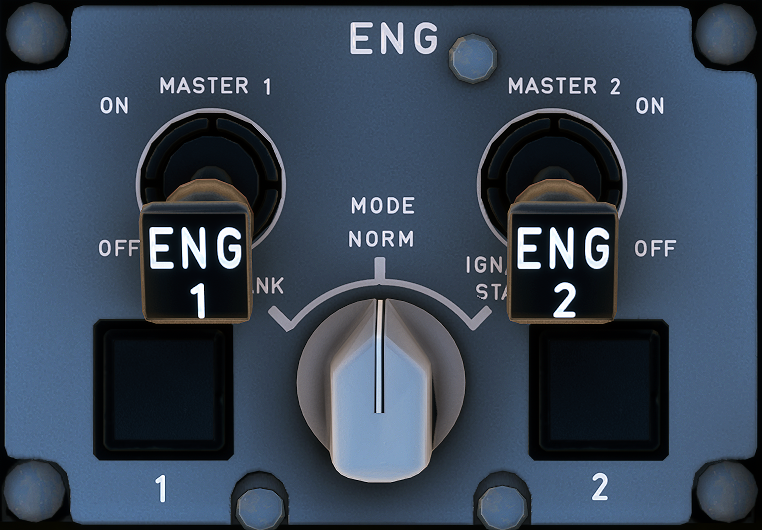

---
hide:
    - navigation
---

# Engine Panel

---

[Back to Flight Deck](../index.md){ .md-button }

---

## Description

The Engine Panel is used to control and start the engines.
It contains Master Switches for each engine and also an Ignition Mode Switch for starting or cranking the engine.

## Controls

### ENG MODE selector

- CRANK:
    - The start valve opens, if the MAN START pushbutton switch is ON. Ignition does not fire.
- NORM:
    - This turns on continuous ignition (A and B) when the engine is running and:
        - The engine anti-ice pushbutton switch is ON, or
        - A flame-out is detected, or
        - An EIU fails.
- IGN START:
    - If the MASTER switch is ON and N2 >= idle, this position selects continuous ignition (A and B).
        - During an automatic start:
            - On the ground, when N2 passes 16 %, ignition switches to A or B. However, if there is an ignition delay during the start sequence, ignition is continuous (A and B).
            - In flight, continuous ignition (A and B) begins when the start sequence begins.
        - During a manual start, ignition commences when the MASTER switch is turned ON. Pack valve closes automatically during the start sequence.
        - Note: On the ground, the ignition cuts off automatically at the end of the start sequence (N2 > 50 %).

### ENG MASTER 1 + 2

- ON:
    - LP fuel valve opens (if the ENG FIRE pushbutton is in).
        - During an automatic start, the HP fuel valve opens if :
        - The ENG MODE selector is at IGN/START.
        - N2 is above the following threshold :
            - 22 % on the ground
            - 15 % in flight
    - During a manual start, the HP FUEL valve opens if :
        - The ENG MODE selector is at IGN/START.
        - The MAN START pushbutton switch is ON.
- OFF:
    - Close signals go directly to the HP fuel valve and the LP fuel valve. These signals cause both channels of the FADEC to be reset.
    - Note : Releasing the ENG FIRE pushbutton allows flight crew to shut down the engine by closing the LP fuel valve. There is a time delay of about 60 seconds at ground idle as the engine burns the fuel left between the LP valve and the nozzles.

- FAULT:
    - This amber light comes on, and a caution appears on ECAM, if there is:
        - an automatic start abort
        - a disagreement between the HP fuel valve position and its commanded position.

---

[Back to Flight Deck](../index.md){ .md-button }

