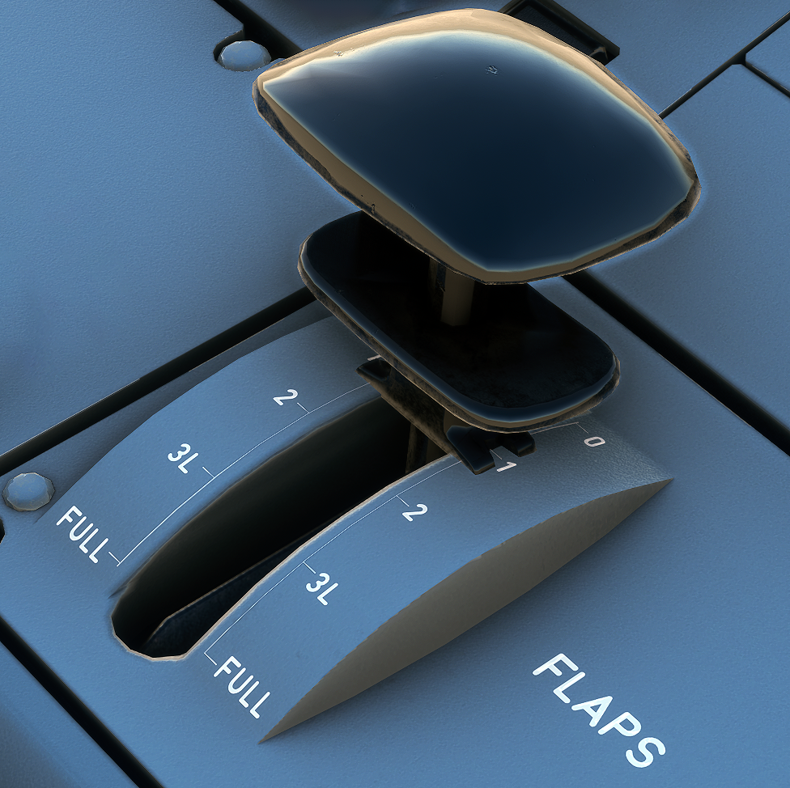

---
hide:
    - navigation
---

# Flaps

---

[Back to Flight Deck](../index.md){ .md-button }

---

{width=50%}

## Controls

### FLAPS lever

The FLAPS lever selects simultaneous operation of the slats and flaps.

The five lever positions correspond to the following surface positions :

| Position | Slats | Flaps | ECAM  | Max Speed | Phase                 |
|:--------:|:-----:|:-----:|:-----:|:---------:|:----------------------|
|    0     |   0   |   0   |       |           | CRUISE                |
|    1     |  18   | 0/10  | 1/1+F |    230    | HOLD / TAKE OFF       |
|    2     |  22   |  15   |   2   |    215    | TAKE OFF / APPR       |
|    3     |  22   |  20   |   3   |    185    | TAKE OFF / LDG / APPR |
|   FULL   |  27   |  40   | FULL  |    177    | LDG                   |

Before selecting any position, the pilot must pull the lever out of the detent. Balks at positions 1 and 3 prevent the pilot from calling for excessive flap/slat travel with a single action.

Note : The pilot cannot select an intermediate lever position.

Takeoff in configuration 1:

- 1 + F (18°/10°) is selected. If the pilot does not select configuration 0 after takeoff, the flaps retract automatically at 210 knots.

Takeoff or go-around in configuration 2 or 3:

- If the pilot selects configuration 1, he gets 1 + F (18°/10°) if airspeed is under 210 knots.
- If the pilot does not select configuration 0 after takeoff, the flaps retract automatically at 210 knots.

Configuration O to configuration 1 in flight:

- Configuration 1 ( 18°/0°) is selected.

Note : After flap retraction, configuration 1 + F is no longer available until the airspeed is 100 knots or Jess, unless configuration 2, 3, or FULL has been selected previously.

---

[Back to Flight Deck](../index.md){ .md-button }

