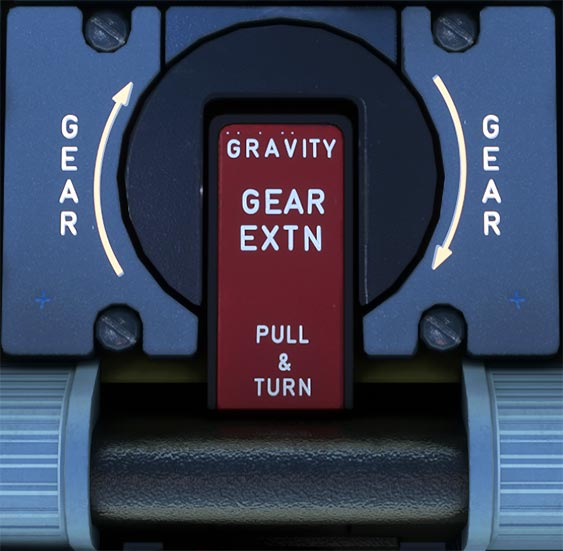

---
hide:
    - navigation
---

# Emergency Gravity Gear Extension

---

[Back to Flight Deck](../index.md){ .md-button }

---

## Description

If the normal system fails to extend the gear hydraulically, the flight crew can use a crank to extend it mechanically.

When a crew member turns the crank clockwise 3 turns, it :

- isolates the landing gear hydraulics from the green hydraulic system,
- unlocks the landing gear doors and the main and nose main gear,
- allows gravity to drop the gear into the extended position.

Locking springs help the crew to crank the main gear into the locked condition, and aerodynamic forces assist in the locking of the nose gear.

The gear doors remain open.
The flight crew can reset the emergency extension system in flight after using it for training (if green hydraulic pressure is available).

---

[Back to Flight Deck](../index.md){ .md-button }
