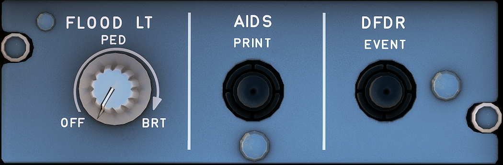

---
hide:
    - navigation
---

# Lighting Pedestal, AIDS, DFDR First Officer Side

---

[Back to Flight Deck](../index.md){ .md-button }

---

### FLOOD LT PED knob

This knob adjusts the brightness of the flood lighting for the pedestal, and turns it on and off.

### AIDS PRINT pushbutton
Pushing this pushbutton causes the immediate printing of a specific report, depending on the flight phase. The crew may then use the MCDU to select another report for immediate printing.

### DFDR EVENT pushbutton

Pressing this button (briefly) sets an event mark on the Flight Data records.

---

[Back to Flight Deck](../index.md){ .md-button }
