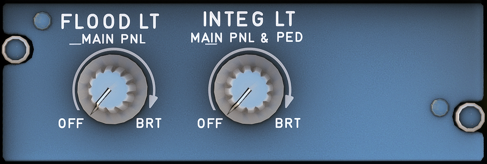

---
hide:
    - navigation
---

# Lighting Pedestal Captain Side

---

[Back to Flight Deck](../flight-deck.md){ .md-button }

---

{ width=60% }

## Usage

### FLOOD LT MAIN PNL knob

- Brightness of the flood lighting for the center instrument panel.

### INTEG LT MAIN PNL and PED knob

- Brightness of integral lighting for the main panel and pedestal.

---

[Back to Flight Deck](../flight-deck.md){ .md-button }
