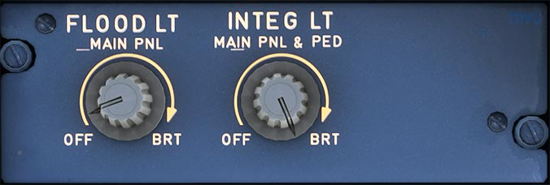

---
hide:
    - navigation
---

# Lighting Pedestal Captain Side

---

[Back to Flight Deck](../index.md){ .md-button }

---

## Usage

### FLOOD LT MAIN PNL knob

- This knob adjusts the brightness of the flood lighting for the center instrument panel, and turns it on and off.

### INTEG LT MAIN PNL and PED knob

- This knob adjusts the brightness of integral lighting for the main panel and pedestal, and turns it on and off.

---

[Back to Flight Deck](../index.md){ .md-button }
