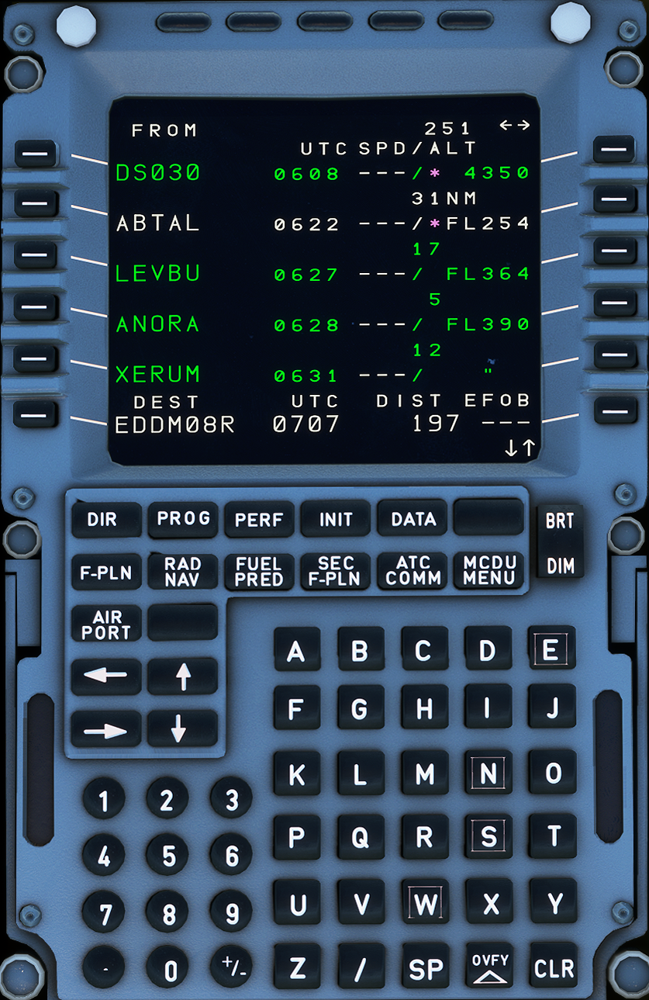

---
hide:
    - navigation
---

# Multipurpose Control and Display Unit

---

[Back to Flight Deck](../flight-deck.md){ .md-button }

---

{width=50%}

## Description

Two MCDUs are installed on the pedestal for flight crew loading and display of data.

The use of the MCDU allows the flight crew to interface with the FMGC by selection of a flight plan for lateral and vertical trajectories and speed profiles.

The crew may also modify selected navigation or performance data and specific functions of Flight Management (revised flight plan, engine-out, secondary flight plan, etc.).

Additional data from peripherals (Centralized Fault Display System (CFDS), ARINC Communications, Reporting System (ACARS) can also
be displayed.

Data that is entered into the MCDU that is illogical or beyond the aircraft capabilities will either be disregarded or will generate an advisory message.

<!-- TODO: UPDATE -->
!!! info "Future Update"
    A more in depth description of the MCDU is currently developed and will be available in the near future.

---

[Back to Flight Deck](../flight-deck.md){ .md-button }
