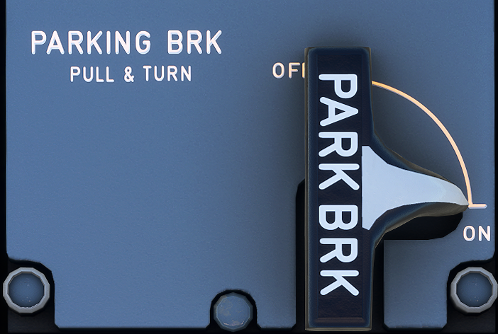

---
hide:
    - navigation
---

# Parking Brake Panel

---

[Back to Flight Deck](../index.md){ .md-button }

---

{width=50%}

## Description

To apply the Parking Brake the flight crew pulls this handle and turns it clockwise.

The message "PARK BRK" appears on the ECAM.

---

[Back to Flight Deck](../index.md){ .md-button }
