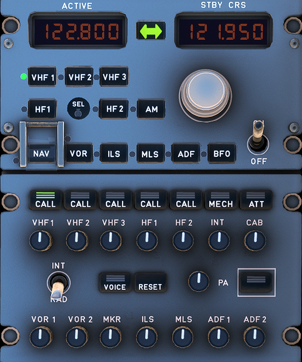
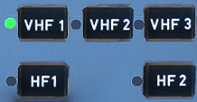
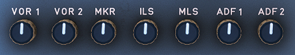

---
hide:
    - navigation
---

# Radio Management and Audio Control Panel

---

[Back to Flight Deck](../index.md){ .md-button }

---

{width=80%}

## Description

The A320 communications has the following subsystems:
- VHF/HF tranceivers
- Radio tuning systems (Radio Management Panels - RMP).
- Audio integrating system (Audio Management Unit - AMU, Audio Control Panels - ACP).

Either of the Radio Management Panels (RMPs) can be used to tune
each transceiver.

To transmit, the flight crew uses the Audio Control Panel (ACP) to select a VHF or HF system. The ACP works through the Audio Management Unit (AMU). Each system is connected to the RMPs, for frequency selection, and to the AMU for connection to the audio integrating and SELCAL (selective calling) systems.

Identical RMPs (Radio Management Panels) :

- Give the flight crew control of all VHF radio communication systems
- Back up to FMGCs for controlling radio navigation systems
- Two RMPs are on the center pedestal and the third is on the overhead panel.
- Each RMP can control any VHF transceiver. RMP1 and RMP2 are connected directly to all VHF transceivers, whereas RMP3 is connected to them via RMP1 and RMP2.
- RMPs are connected together so that each RMP is updated to the selections made on other RMPs.
- Only RMP1 functions in EMER ELEC CONFIG.

## Usage

### Frequency displays

- The ACTIVE display window shows the active frequency of the selected radio, which is identified by a green light on the selection key.
- The STBY/CRS (standby/course) display window shows a standby frequency that the pilot can activate by pressing the transfer key or change by rotating the tuning knobs.

###  Transfer key

- Pressing this key moves the active frequency to the standby window and the standby frequency to the active window.
- This tunes the selected receiver to the new active frequency.

### Radio com selection keys

- When the pilot presses one of these keys :
    - The ACTIVE window displays the frequency set on that radio.
    - The STBY/CRS window displays the selected standby frequency or course.
    - The selected key displays a green monitor light.

### Frequency selector knobs

The pilot uses these concentric knobs to select the STBY frequency or CRS. The outer knob controls whole numbers; the inner knob controls decimal fractions.

### AM pushbutton

If the aircraft has HF radios and the flight crew has selected an HF tranceiver, this switch selects the AM mode. (The default mode is the SSB, or single side-band, mode).

This key displays a green monitor light when the AM mode is active.

### SEL indicator

The SEL indicator glows white on both RMPs when a transceiver normally associated with one RMP is tuned by another:

- VHF1 tuned by RMP2 or RMP3,
- VHF2 tuned by RMP1 or RMP3.
- VHF3, HF1, HF2 (/41) tuned by RMP1 or RMP2.

### NAV pb sw (with transparent switchguard)

The pilot presses this key to be able to select navigation receivers and courses through the RMP. It does not affect the selection of communication radios and their frequencies.

### Radio navigation selection keys

The pilot presses one of these keys to select a navigation radio to control through this RMP. This turns on the green monitor light in the key.

### ON/OFF sw

This switch controls the power supply to the RMP.

Note: RMP3 is able to control VHF and HF transceivers through RMP1 and RMP2 even when they are OFF.

### Tansmission Keys

- Pressed:
    - The associated channel is selected for transmission.
    - The three green lines come on.
    - The pilot deselects the channel by pressing the pushbutton again, or by selecting another channel.
- CALL:
    - The legend flashes amber (and buzzer sounds) when the SELCAL system detects a call.
- MECH:
    - The legend flashes amber (and buzzer sounds) for a call from the nose gear bay. The MECH light goes off after 60 seconds, if it is not reset.
- ATT:
    - The legend flashes amber (and buzzer sounds) for a call from a cabin attendant. The ATT light goes off after 60 seconds, if it is not reset.

### Reception Knobs

These knobs allow the flight crew to select reception channels and to adjust their volume.

- Pressing and releasing the knob (knob out) selects the associated audio reception channel. The integral white light comes on. Rotating the knob adjusts the volume.
- Pressing the knob (knob stays in) disconnects the associated audio reception channel.

Note : For reception of DME audio navigation signals associated to an ILS or MLS station, the ILS (or LS) pushbutton on the FCU must also be selected.

### RESET

Pressing this key extinguishes CALL, MECH, and ATT lights.

### VOICE

This key allows the flight crew to inhibit the audio navigation signals (VOR, ADF). Pressing this key filters out ident signals and turns on the green ON light.

### INT/RAD

This switch operates as a press-to-talk switch for boom mike or oxygen mask mike.

- INT:
    - Boom and mask mikes transmit on interphone regardless of which transmission key is selected. For reception on interphone, the crew member must have INT selected (INT reception knob out).
- Neutral:
    - Reception is normal. Boom and mask mikes do not transmit.
- RAD (press and hold):
    - Boom and mask mikes transmit on the radio selected on the audio control panel.

### PA (Passenger Address)

The passenger address allows flight personnel to make announcements to passengers in the cabin through loudspeakers. It can be operated from the cockpit (with ACP or handset) or from the cabin (attendant stations).

#### PA transmission key

Pressed and held: The flight crew may use a boom, mask, or hand mike to make an announcement. Three green lines come on.

Note : The flight crew may use a cockpit handset to make PA announcements without action on the ACPs.

#### PA reception knob

- Pressed and released (knob out):
    - The message goes to the loudspeakers and the integral white light comes on. The flight crew can rotate the knob to adjust the volume.
- Pressed (knob in):
    - The PA system is disconnected. The white light goes out.

---

[Back to Flight Deck](../index.md){ .md-button }
