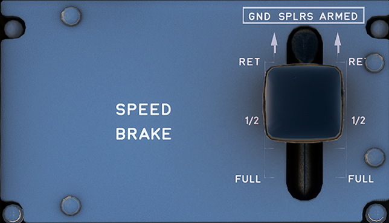

---
hide:
    - navigation
---

# Speed Brake

---

[Back to Flight Deck](../index.md){ .md-button }

---

## Controls

### SPEEDBRAKE lever

The lever controls:

- The position of the speedbrake surfaces. To set speedbrake surfaces to a required position, the lever has to be pushed down and set to the required position. A "hardpoint" is provided at "½" SPEEDBRAKE position.
- The manual preselection of the ground spoilers. To arm the ground spoilers, the lever must be pulled up when in the RET position. When the lever is armed (or reverse thrust is selected), all spoiler's surfaces will automatically extend at landing, or in case of a rejected takeoff.

---

[Back to Flight Deck](../index.md){ .md-button }

