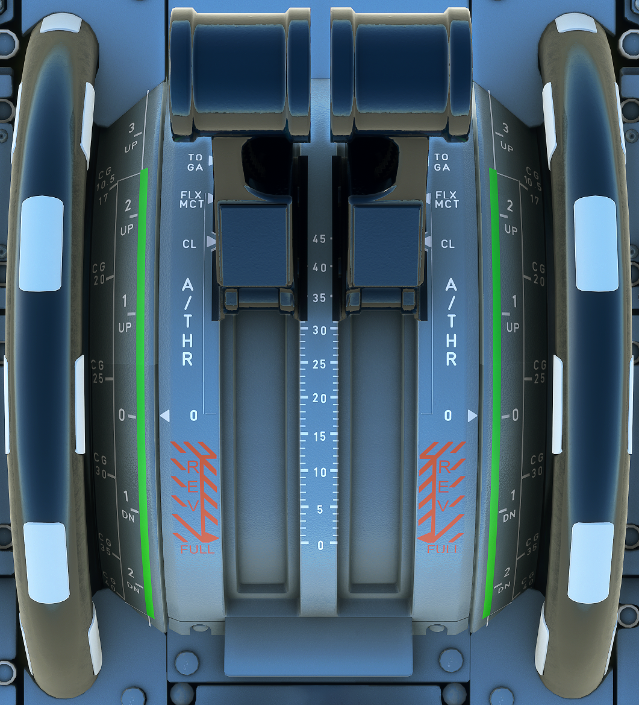

---
hide:
    - navigation
---

# Thrust Lever and Elevation Trim

---

[Back to Flight Deck](../flight-deck.md){ .md-button }

---

{width=80%}

## Description

A FADEC dedicated to each engine controls thrust.

The pilot uses the thrust levers to set the thrust in manual mode, and the FMGS sets the thrust in automatic mode.

The FADEC prevents the thrust from exceeding the limit for the thrust lever position in both manual and automatic modes.

The thrust levers can only be moved manually.

They move over a sector that is divided into four operating segments.

The sector has five positions defined by detents or stops.

Thrust lever position is transmitted to the FADEC, which computes and displays the thrust rating limit and the N1 for that Thrust Lever Angle (TLA).

Note: There is no reverse idle detent. When the pilot moves the lever out of the idle stop by pulling up the reverse lever on the front of the thrust lever, he selects reverse idle.

The FADEC computes the thrust rating limit for each thrust lever position.

If the thrust lever is set in a detent, the FADEC selects the rating limit corresponding to this detent.

If the thrust lever is set between two detents, the FADEC selects the rating limit corresponding to the higher detent.

### Manual Thrust Control

The engines are in the manual mode provided the A/THR function is:

- not armed or
- armed and not active (thrust lever not in the A/THR operating range and no alpha floor).

In these conditions, each engine is controlled by the position of its thrust lever.

The pilot controls thrust by moving the thrust lever between the IDLE and TOGA positions.

Each position of the thrust lever within these limits corresponds to an N1.

When the thrust lever is in a detent, the corresponding N1 is equal to the N1 rating limit computed by the FADEC for that engine.

When the thrust lever is in the FLX/MCT detent:

- On the ground
    - The engine runs at the flex takeoff thrust rating if the crew has selected a flex takeoff temperature on the MCDU that is higher than the current Total Air Temperature (TAT). Otherwise the engine produces Maximum Continuous Thrust (MCT).
    - Note: A change in FLEX TEMP during the takeoff has no effect on the thrust.
- After takeoff
    - The pilot can change from FLX to MCT by moving the thrust lever to TOGA or CL, then back to MCT. After that, he cannot use the FLX rating.
    - Note: Setting the thrust lever out of FLX/MCT detent without reaching TOGA or CL detent has no effect.

The pilot can always get MAX TO thrust by pushing the thrust lever all the way forward.

### Automatic Thrust Control

In the autothrust mode (A/THR function active), the FMGC computes the thrust which is limited to the value corresponding to the thrust lever position (unless the alpha-floor mode is activated).

### PITCH TRIM wheel

Both pitch trim wheels provide mechanical control of the Trimmable Horizontal Stabilizer (THS) and have priority over electrical control. A pilot action on the pitch trim wheel disconnects the autopilot.

Note: Crew action on the pitch trim wheel does not disconnect the ELACs (micro-switches, actuated by the override mechanism, ensure that the computers remain synchronized with the manually-selected position).

The THS is manually-controlled on ground for the THS setting, before takeoff and in flight, when in direct law.

- Before takeoff, the pilot sets the THS to the angular value, determined as a function of the aircraft CG, using the CG scale on the wheel. The relationship between the aircraft CG and the THS setting shown on the trim wheel is only applicable for takeoff. The limits of the THS normal setting range for takeoff are indicated by a green band on the pitch trim wheel.
- In flight, when in direct law, the pilot uses the THS conventionally to fly in trim. In flight, the aircraft pitch trim setting depends on aircraft CG, weight, altitude and speed. Consequently, the relation between the aircraft CG, and the THS setting displayed on the pitch trim wheel, does not apply in flight.

Following nosewheel touchdown, as the pitch attitude becomes less than 2.5° for more than 5 seconds, pitch trim is automatically reset to zero.

Note: This function is inoperative, when the green or yellow hydraulic system is not pressurized.

---

[Back to Flight Deck](../flight-deck.md){ .md-button }
