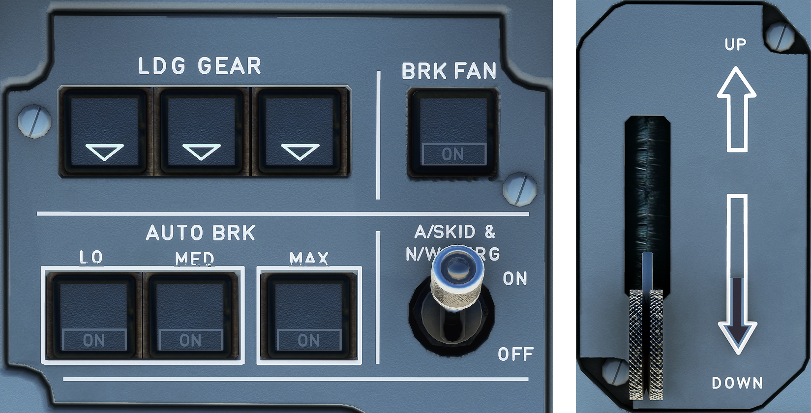

---
hide:
    - navigation
---

# Autobrake and Gear Indications

---

[Back to Flight Deck](../flight-deck.md){ .md-button }

---

## Description

## Usage

### Landing Gear Indicator Panel

This panel is connected to LGCIU1, which receives signals from proximity detectors.

- UNLK : come on red if the gear is not locked in the selected position.
- Green Triangle: come on green if the gear is locked down.

Note: The lights on the LDG GEAR indicator panel come on as Jong as the LGC/U1 is electrically supplied.

### L/G LEVER

- UP:
    - This position selects landing gear retraction. While the landing gear doors are opening, the normal brake system brakes the wheels of the main gear automatically. A brake band in the nose gear well brakes the nose gear wheels as the doors close.
- DOWN:
    - This position selects landing gear extension. An interlock mechanism prevents anyone from accidentally retracting the gear while the aircraft is on the ground. It does so by locking the lever in DOWN position when the shock absorber on either main gear is compressed (aircraft on ground) or the nose wheel steering is not centered. The landing gear hydraulic system remains pressurized as long as the landing gear is extended (if green hydraulic pressure is available).

### RED ARROW

This red arrow lights up if the landing gear is not locked down when the aircraft is in the landing configuration, and a red warning appears on ECAM.

### A/SKID & N/W STRG sw

The anti-skid system produces maximum braking efficiency by maintaining the wheels just short of an impending skid.

When a wheel is on the verge of locking, the system sends brake release orders to the normal and alternate servo valves - and to the ECAM, which displays the released brakes.

The anti-skid deactivates when ground speed is less than 20 knots.

- ON:
    - If green hydraulic pressure is available :
        - Anti-skid is available.
        - Nose wheel steering is available.
    - If green hydraulic pressure is lost:
        - Yellow hydraulic pressure takes over automatically to supply the brakes.
        - Anti-skid remains available.
        - Nose wheel steering is lost.
        - The triple indicator shows yellow system brake pressure.
- OFF:
    - Yellow hydraulic system supplies pressure to the brakes.
    - Anti-skid is deactivated. The pilot must refer to the triple indicator to limit brake pressure and avoid locking a wheel.
    - Nose wheel steering is lost.
    - Differential braking remains available through the pedals.
    - The triple indicator displays yellow system brake pressure.

### AUTO/BRK panel

The springloaded MAX, MED, and LO pushbutton switches arm the appropriate
deceleration rate.

- MAX:
    - MAX mode is normally selected for takeoff. If the pilot aborts the takeoff, maximum pressure goes to the brakes as soon as the system generates the ground spoiler deployment order.
- MED or LO:
    - MED or LO mode is normally selected for landing.
      - LO mode sends progressive pressure to the brakes 4 seconds after the ground spoilers deploy in order to decelerate the aircraft at 1.7 meters/second^2^ (5.6 feet/second^2^ ).
      - MED mode sends progressive pressure to the brakes 2 seconds after the ground spoilers deploy in order to decelerate the aircraft at 3 meters/second^2^ (9.8 feet/second^2^).
- Lights :
    - The blue ON light comes on to indicate positive arming.
    - The green DEC EL light comes on when the actual deceleration is 80% of the selected rate.
    - Note: On slippery runway, the predetermined deceleration may not be reached due to antiskid operation. In this case DECEL light will not illuminate. This does not mean that autobrake is not working.
    - Off:
        - The indicated brake mode is not active.

### BRK FAN pb sw

- ON:
    - The brake fans run if the lefthand main landing gear is down and locked.
- OFF:
    - The brake fans stop.
- HOT Lt:
    - This amber light comes on when the brakes get too hot. (A caution appears on ECAM, also).

---

[Back to Flight Deck](../flight-deck.md){ .md-button }
