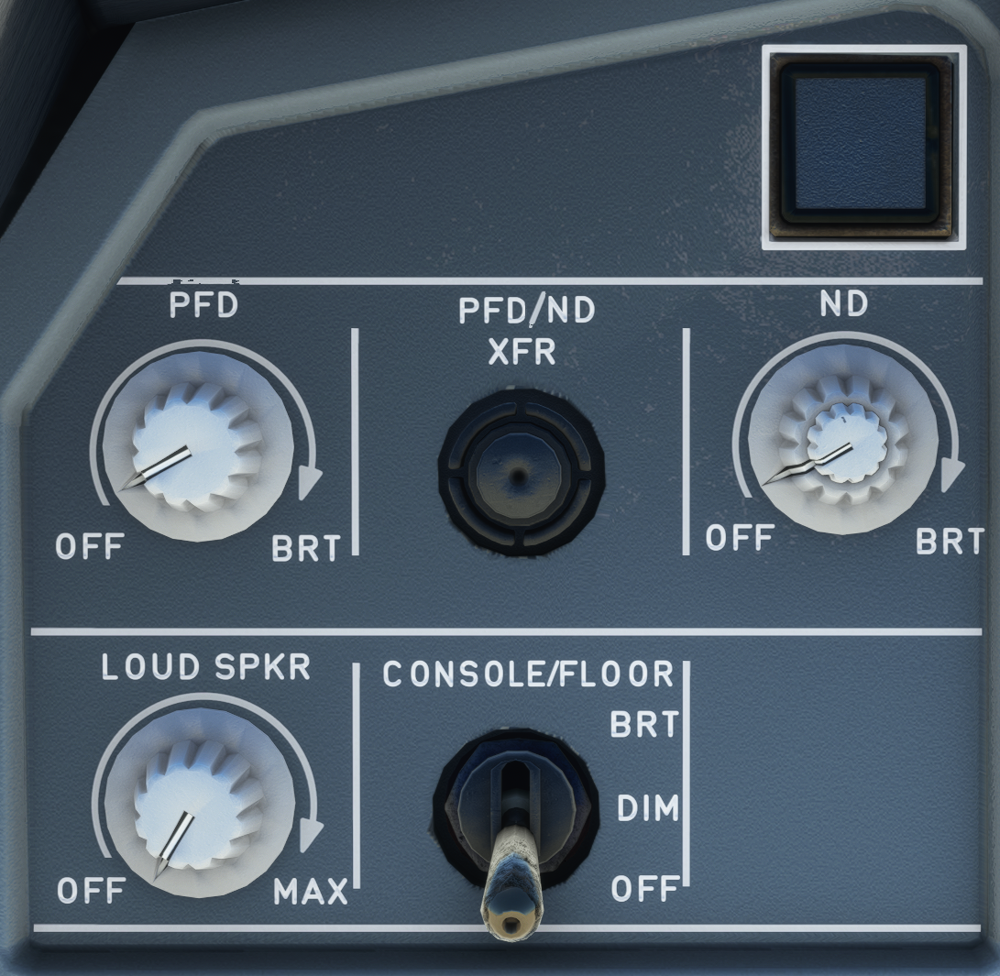

# Instrument Lighting Control Panel

---

Back to [Flight Deck](../flight-deck.md)

---

{width=50%}

## Description

## Usage

### OFF/BRT knobs

- These knobs turn the PFD and ND display units on and off, and control their brightness.
- The display brightness automatically adjusts for changing light conditions. It may also be adjusted manually.
- PFD Brightness Control Knob
    - Rotating this knob all the way counterclockwise switches off the PFD. In this case, the PFD image is automatically displayed on the NDU, but the pilot may recover the ND by means of the PFD-ND XFR pushbutton.
- ND Brightness Control Knob
    - The outer knob controls the brightness of both the weather radar image and the EGPWS terrain display. The inner knob controls the general brightness of the ND symbols. Rotating this knob all the way counterclockwise switches off the NDU.

### PFD/ND XFR Pushbutton

Pushing this button interchanges the PFD and the ND. If the PFDU fails, the PFD automatically transfers to the NDU.

<!-- TODO: - which one is build into the FBW??? -->

### GPWS – G/S pushbutton

- GPWS: This red light comes on when any mode from 1 to 4, or any TAD or TCF alert is activated. A specific voice alert accompanies it.
- G/S: Comes on amber when Mode 5 is activated. It is accompanied by the aural “GLIDE SLOPE” warning.
- Note:
    - If the flight crew presses this button briefly when a glide slope warning is on, the G/S light goes out and the “GLIDE SLOPE” aural warning (soft or loud) stops.
    - On ground, the GPWS can be tested by pressing this pushbutton. If the pushbutton is pressed briefly, some of the aural warnings sound and pushbutton captions, related to the GPWS, come on. If the pushbutton is pressed continuously, then all the aural warnings sound.

### PULL UP – GPWS pushbutton
- PULL UP: Comes on when the second boundary of mode 1 is penetrated or when the mode 2 is activated. A “PULL UP” or “TERRAIN - TERRAIN PULL UP” voice warning accompanies it.
- GPWS: Comes on in amber when any other mode is activated. It is accompanied by a corresponding aural alert.
- Note:
    - If the flight crew briefly presses this button, when mode 5 alert is heard, the GPWS light goes out and the aural alert stops.
    - The GPWS can be tested by pressing this pushbutton (on ground only).

### Loudspeaker Volume Knob

This knob adjusts the volume of the loudspeaker for radio communication.

- OFF: Loudspeaker does not respond to signals from the aircraft's radio
equipment.
- Clockwise rotation: Loudspeaker broadcasts signals from the aircraft's radio equipment at increasing volume.
- Note: This knob does not control the loudness of aural alert and voice messages. In the case of acoustic feedback (i.e. Larsen effect) from the cockpit loudspeaker, the flight crew should reduce the volume of the cockpit loudspeaker. However, the flight crew should ensure that the volume of the cockpit loudspeaker is sufficient to hear radio communication.

---

Back to [Flight Deck](../flight-deck.md)
