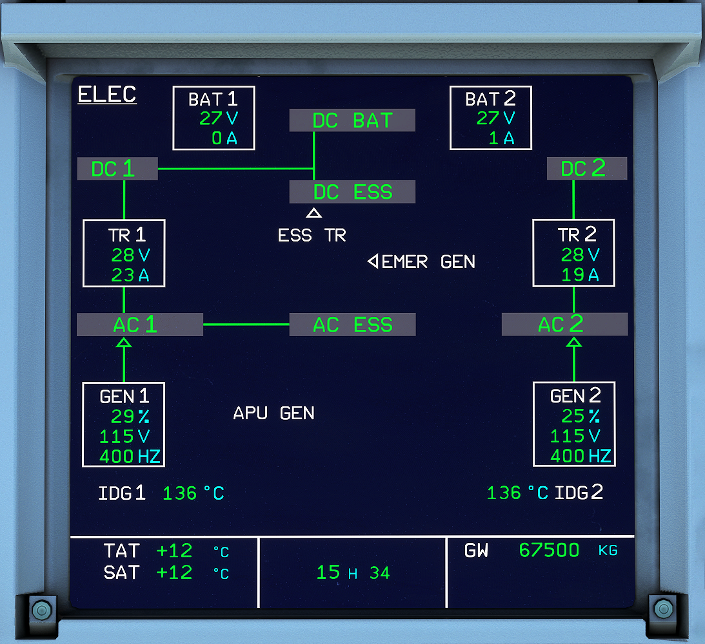

# System Display (Lower ECAM)

---

Back to [Flight Deck](../flight-deck.md)

---

## Description

The Electronic Centralized Aircraft Monitor (ECAM) consists of two displays:

- the Engine and Warning Display (E/WD) aka Upper ECAM
    - Primary engine indications, fuel quantity, flap and slat position
    - Warning and caution alerts, or memos
- the Systems Display (SD) aka Lower ECAM
    - Synoptic diagrams of aircraft systems, and status messages
    - Permanent flight data

<!-- TODO: UPDATE -->
**A more in depth description of the ECAM is currently developed and will be available in the near future.**

---

Back to [Flight Deck](../flight-deck.md)
