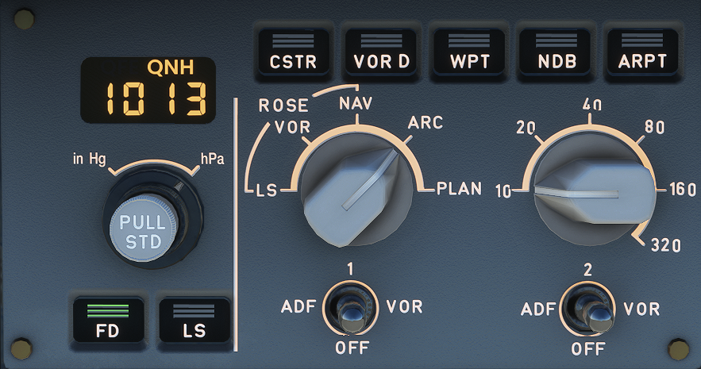

# EFIS Control Panel

---

Back to [Flight Deck](../flight-deck.md)

---

## Description

The EFIS control panels for:

- Selection of desired ND modes (ROSE-ILS, -VOR, ARC, PLAN) and ranges,
- Selection of baro setting.

---

Back to [Flight Deck](../flight-deck.md)

