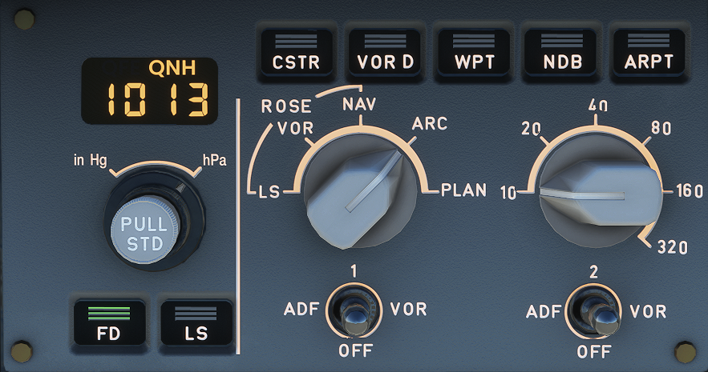

# EFIS Control Panel

---

Back to [Flight Deck](../flight-deck.md)

---

## Description

The EFIS control panels for:

- Selection of desired ND modes (ROSE-ILS, -VOR, ARC, PLAN) and ranges,
- Selection of baro setting.

## Controls and Indications

### Barometer Reference Display Window

- Range : 745 hPa to 1100 hPa.

### Barometer Reference Selector

- Outer ring: For selection of the units for the barometer reference-either hectoPascals or inches of mercury.

    Note : The unit selected does not appear on the PFD.

- Inner knob : For selection of the reference value displayed in the barometer reference display window and on the PFD below the altitude scale. At FCU initialization, the window displays 1013 or 29.92, depending on the unit selected.

    - Pulling the knob selects the standard baro reference setting. The PFD then displays "STD." (Rotating the knob has no effect.)
    - Pushing the knob from the STD position makes the last selected OFE or ONH baro setting available.
    - Pushing the knob again changes from ONH to OFE or vice versa. The window displays "QNH" or "QFE'' according to the pilot selection.

- Note : QFE option is a pin program installed on the FMGC and the GPWS computers. These computers will work using the selected pin program (QNH or QFE), independently of the baro reference setting selected on the EFIS CTL panel.

###  FD Pushbutton

- Pushing this button removes the FD bars from the associated PFD (or removes the flight path director symbol if the TRK FPA reference is selected).
- The pushbutton light goes out.
- Pushing it again restores the FD bars (or the FPO symbol) and the green pushbutton light comes on.

###  LS Pushbutton

- Pushing this button displays the localizer and glide slope scales on the PFD.
- Deviation symbols appear if there is a valid ILS signal.

The green pushbutton light comes on.

### Mode Select Switch

- This switch selects a navigation display for the onside ND.

### Range Select Switch

- This switch selects a range scale for the onside ND.

- Note : If the mode or the range data fails, the default selection is the ROSE NA V mode and 80 NM range.

### ADF-VOR Select Switches

- These switches select ADF or VOR bearing pointers and DME distance on the onside ND, as well as the corresponding navaid data characteristics in any mode except PLAN mode.

### Optional Data Display Pushbutton (CSTR, VOR D, WPT, NDB, ARPT)

- Pushing this button displays optional data in addition to the data permanently displayed in PLAN, ARC, or ROSE NAV modes. The green pushbutton light comes on. Only one option can be activated at a time.

---

Back to [Flight Deck](../flight-deck.md)

