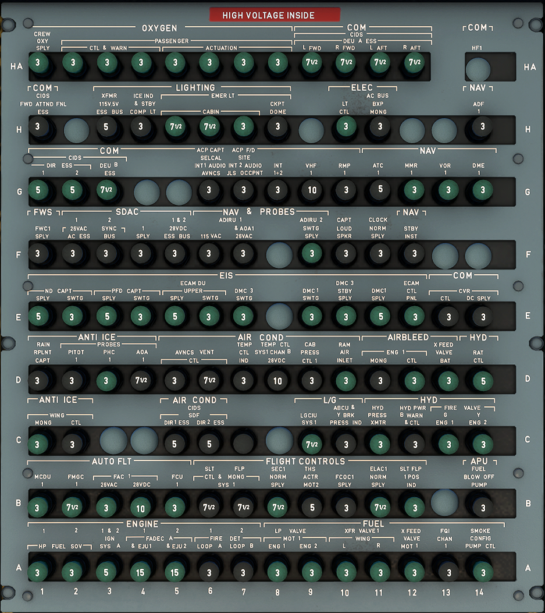
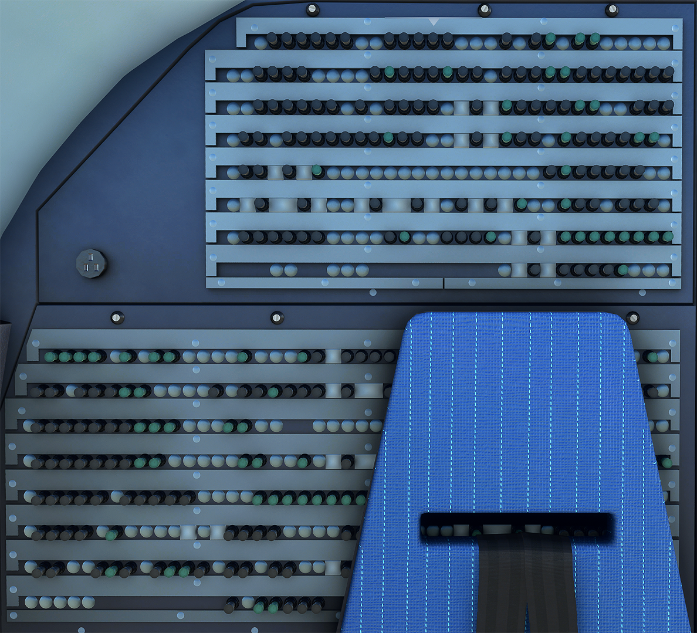

---
hide:
    - navigation
---

# Circuit Breaker Panel

---

[Back to Flight Deck](../flight-deck.md){ .md-button }

---

## Description

The Overhead Aft Panel contains the Emergency Circuit Breaker Panel.

The aircraft has two types of C/Bs :

- Monitored (green) : When out for more than one minute, the C/B TRIPPED warning is triggered on the ECAM.
- Non-monitored (black).

The C/B TRIPPED warning on the ECAM indicates the location of the affected C/B. The following panels are monitored : OVHD PNL, L(R) ELEC BAY, REAR PNL J-M or N-R or S-V or W-Z.

Note : The C/B TRIPPED, caution may be cleared from the ECAM by pressing the CLR or the EMER CANCEL pushbutton. If the EMER CANCEL is used, and if a second C/B is tripped on the same panel, the corresponding C/B TRIPPED caution will not be triggered.

!!!info "Overhead Aft Panel"
    The Overhead Aft Panel is usually not used during flight.

## Rear Right Back Panel

There are further "Secondary Circuit Breakers" on the Rear Right Panel.

{width=320}

---

[Back to Flight Deck](../flight-deck.md){ .md-button }
