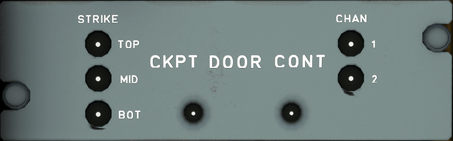

# Cockpit Door Panel

---

Back to [Flight Deck](../flight-deck.md)

---

### Strikes' status lights

- Off : The corresponding (upper, mid, or lower) locking latch is operative.
- On : The corresponding (upper, mid, or lower) locking latch is faulty.

###  Pressure sensor

Two redundant differential pressure sensors enable rapid pressure variation in the cockpit to be detected, in order to command simultaneous opening of all latches when a defined pressure
drop is detected.

### Pressure sensor status lights

- Off : The corresponding (1 or 2) pressure sensor is operative.
- On : The corresponding (1 or 2) pressure sensor is faulty.

Note: These indicators enable the crew to identify the faulty item, when the Central Pedestal Fault indicator light is ON.

---

Back to [Flight Deck](../flight-deck.md)

