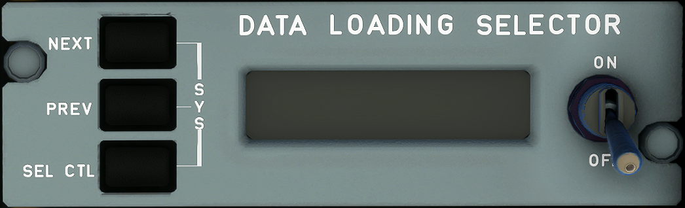

# Circuit Breaker Panel

---

Back to [Flight Deck](../flight-deck.md)

---

{width=320}

This panel helps the aircraft maintenance team to review and update the aircraft's databases.

The A320neo has the following software & databases:

- FMS Software
- NAV Database
- Airline Modifiable Information Database
- Operational Program Configuration (OPC)
- PERF Database
- Magnetic Variation Database (MAG VAR)

---

Back to [Flight Deck](../flight-deck.md)

