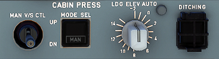

---
hide:
    - navigation
---

# Cabin Pressurization

---

[Back to Flight Deck](../flight-deck.md){ .md-button }

---

## Description

The cabin pressurization system has four general functions:

- Ground function: Fully opens the outflow valve on ground.
- Prepressurization: During takeoff, increases cabin pressure to avoid a surge in cabin pressure during rotation.
- Pressurization in flight : Adjusts cabin altitude, and rate of change to provide passengers with a comfortable flight.
- Depressurization: After touchdown, gradually releases residual cabin overpressure before the ground function fully opens the outflow valve.

The system consists of:
- Two Cabin Pressure Controllers (CPC)
- One outflow valve, with an actuator that incorporates three motors (two for automatic operation, one for manual operation)
- One control panel
- Two safety valves

Any one of the three independent electric motors may power the outflow valve. Normally, one of the two cabin pressure controllers operates the outflow valve by means of its associated automatic motor.

In case of ditching, an override switch on the control panel allows the flight crew to close the outflow valve and all valves below the flotation line.

The flight crew can set the system to operate automatically, semi-automatically, or manually.

In normal operation, cabin pressurization is fully automatic.

Ground (GN)

Before takeoff, and 55 seconds after landing, the outflow valve fully opens to ensure that there is no residual cabin pressure. At touchdown, any remaining cabin pressure is released at a cabin vertical speed of 500 feet/minute.

Takeoff (TO)

To avoid a pressure surge at rotation, the controller pre-pressurizes the aircraft at a rate of 400 feet/minute, until the &#916;P reaches 0.1 PSI. At lift-off, the controller initiates the climb phase.

Climb (CL)

During climb, the cabin altitude varies according to a fixed pre-programmed law that takes into account the aircraft's actual rate of climb.

Cruise (CR)

During cruise, the controller maintains cabin altitude at the level-off value, or at the landing field elevation, whichever is higher.

Descent (DE)

During descent, the controller maintains a cabin rate of descent, such that cabin pressure equals the landing field pressure, just before landing. The maximum descent rate is 750 feet/minute.

Abort (AB)

If the aircraft does not climb after takeoff, the abort mode prevents the cabin altitude from climbing. Cabin pressure is set back to the takeoff altitude + 0.1 PSI.

## Usage

###  LOG ELEV sel

- AUTO: The pressurization system uses the FMGS data to construct an
optimized pressure schedule. To exit the AUTO position, pull out and turn the selector.
- Other positions: The pressurization schedule does not use the landing elevation from the FMGS, but instead uses the landing elevation selected with this knob (from - 2000 to + 14000 feet) as its reference. 
  Note : The LDG ELEV selector scale is only given as an indication; refer to the ECAM information for accurate adjustment.

### MODE SEL

- AUTO: Automatic mode is operating. One of the two systems controls the
outflow valve. 
    Note : If the pilot suspects that the operating pressurization system is not performing properly, he can attempt to select the other system by switching the MODE SEL pushbutton to MAN, for at least 10 seconds, then returning it to AUTO.
- MAN: This legend appears in white, and FAULT does not come on. The flight crew then uses the MAN V/S CTL switch to control the outflow valve.
- FAULT: This legend appears in amber and the ECAM caution light comes on only when both automatic systems are faulty. 
    Note : The pilot may notice a variation in the CAB ALT indication on the ECAM PRESS page, when the system switches from the cabin pressure control AUTO mode to MAN mode, due to the reduced resolution of the backup pressure sensor.

### MAN V/S CTL

The switch, spring loaded to neutral, controls the outflow valve position through operation of the MAN motor, when the MODE SEL pushbutton is in the MAN position.

- UP: The valve moves towards the open position.
- DN : The valve moves towards the closed position. 

Note : The outflow valve operates slowly, so the pilot must hold the toggle switch in the UP or DN position until reaching the target VIS.

### DITCHING guarded

- Normal: The system functions normally.
- ON: The operating system sends a "close" signal to the outflow valve, emergency ram air inlet, avionics ventilation inlet and extract valves, and pack flow control valves. 
    Note: The outflow valve will not close automatically, if it is under manual control.

---

[Back to Flight Deck](../flight-deck.md){ .md-button }

