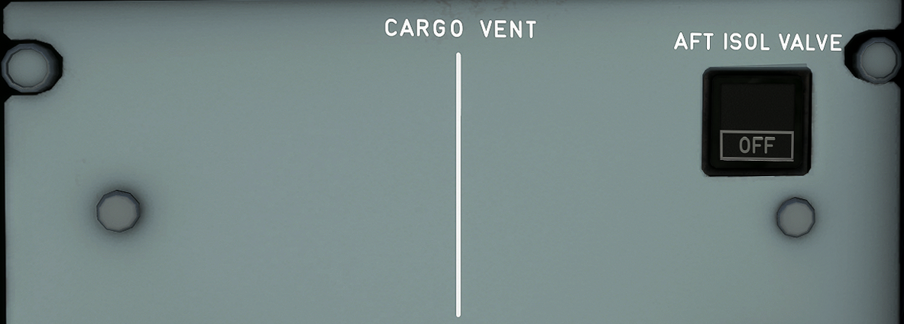

---
hide:
    - navigation
---

# Fire Control Panel

---

[Back to Flight Deck](../flight-deck.md){ .md-button }

---

## Usage

### AFT ISOL VALVE

The switch controls the aft isolation valves and the extraction fan.

- Auto:
    - The inlet and outlet isolation valves open and the extraction fan runs if there is no smoke detected in the aft cargo bay.
- OFF:
    - The inlet and outlet isolation valves and the trim air valve close, the extraction fan stops.
- FAULT Lt:
    - The light comes on amber associated with ECAM caution when either inlet or outlet valve is not in the selected position.

---

[Back to Flight Deck](../flight-deck.md){ .md-button }

