---
hide:
    - navigation
---

# Exterior Lighting

---

[Back to Flight Deck](../flight-deck.md){ .md-button }

---

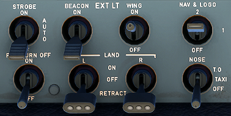

## Usage

### STROBE

This switch turns on and off the three synchronized strobe lights, one on each wing tip and one below the tail cone.

- ON: The strobe lights flash white.
- AUTO: The strobe lights come on automatically when the main gear strut is not compressed.
- OFF: The strobe light are off.

Strobes are turned on latest when airborne usually shortly before the take of roll.

{width=360}

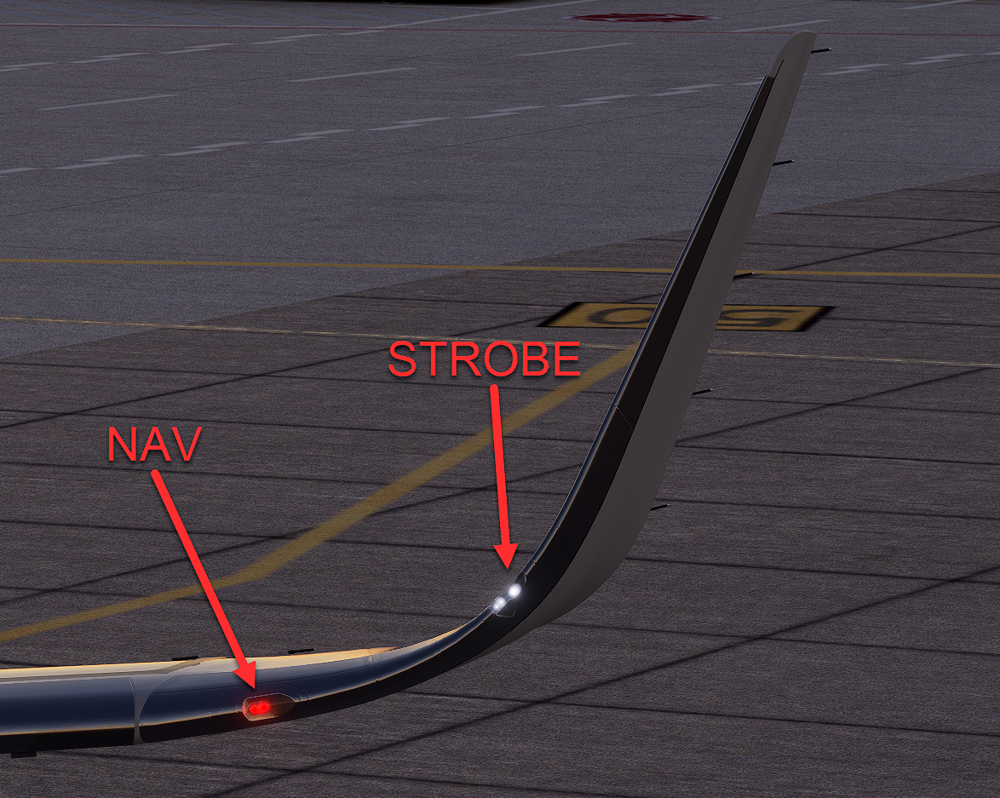{width=360}

### BEACON

This switch turns on and off the two flashing red lights, one on top and one on the bottom of the fuselage.

Signals the ground crew that the engines are about to start or running.

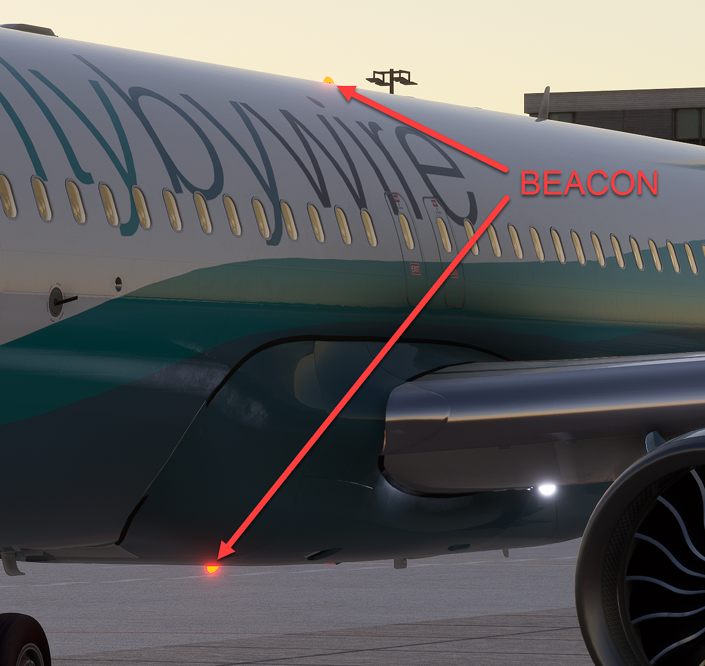

### WING

This switch turns on and off two beam lights on each side of the fuselage. These lights illuminate the leading edge of the wing and the engine air intake to show if ice is accumulating there.

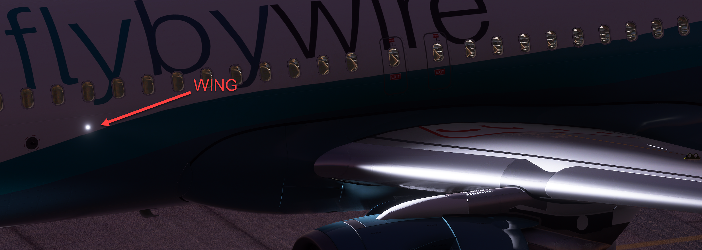

### NAV & LOGO

This switch turns the navigation lights on and off. 
There are dual navigation lights on each wing tip and in the APU tail cone. 
Logo lights are installed in the upper surface of each horizontal stabilizer to illuminate the company logo on the vertical stabilizer provided the main gear struts are compressed or the slats are extended.

- 1: Turns on the logo lights and the first set of navigation lights.
- 2: Turns on the logo lights and the second set of navigation lights.
- OFF: All lights are off.

NAV & LOGO are turned on when the aircraft is powered up (EXT PWR or APU or ENG).

### RWY TURN OFF

This switch turns the runway turn-off lights on and off.

Note : These lights go off automatically when landing gear is retracted.

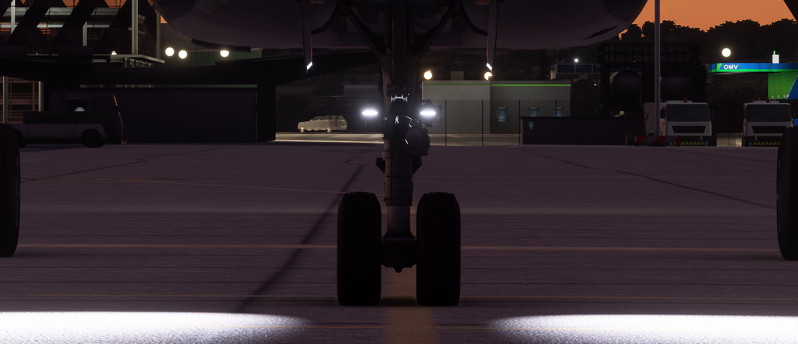

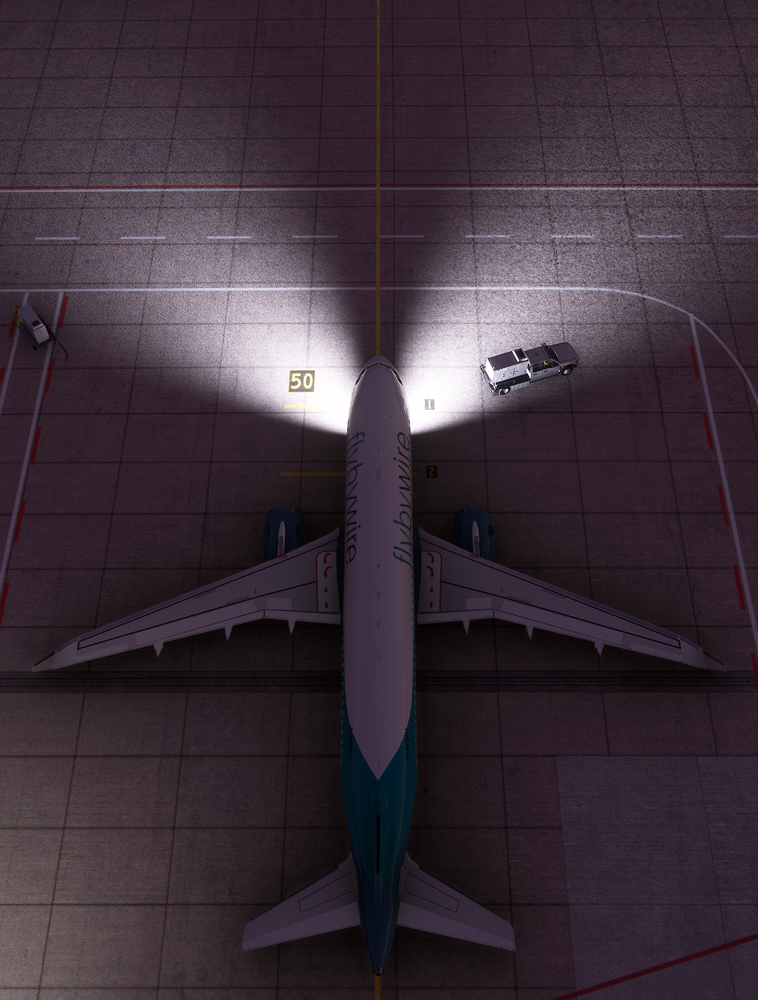

### LAND L + R

These selectors control the landing light.

- ON: Extends the (left or right) landing light which comes on automatically when fully extended.
- OFF: Shut off the landing light but leaves it extended.
- RETRACT: Retracts the landing light and shuts it off.

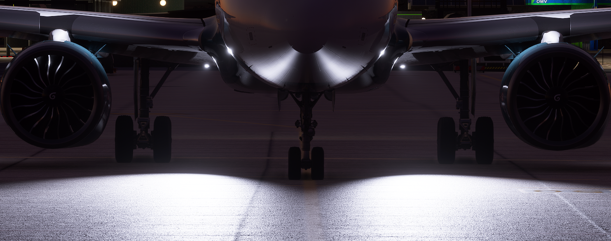

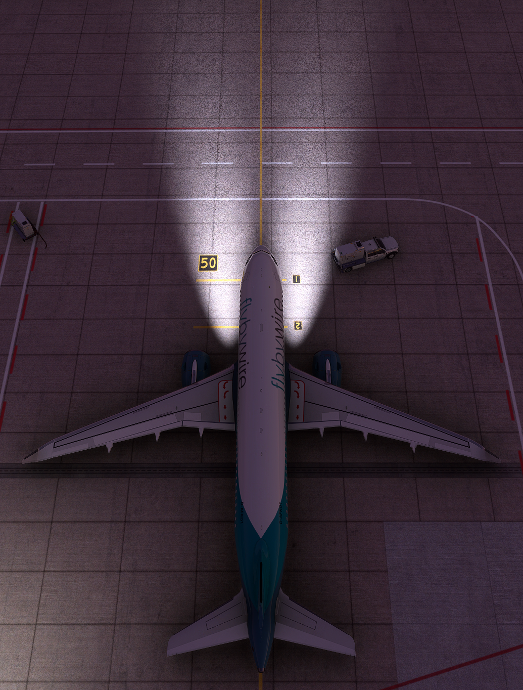

### NOSE

This switch turns the taxi and takeoff lights on and off.

- T.O.: Turns on both taxi and takeoff lights.
- TAXI: Turns on only taxi light.
- OFF: Taxi and takeoff lights off.

Note : These two lights, attached to the nose gear strut, go off automatically when landing gear is retracted.

#### TAXI

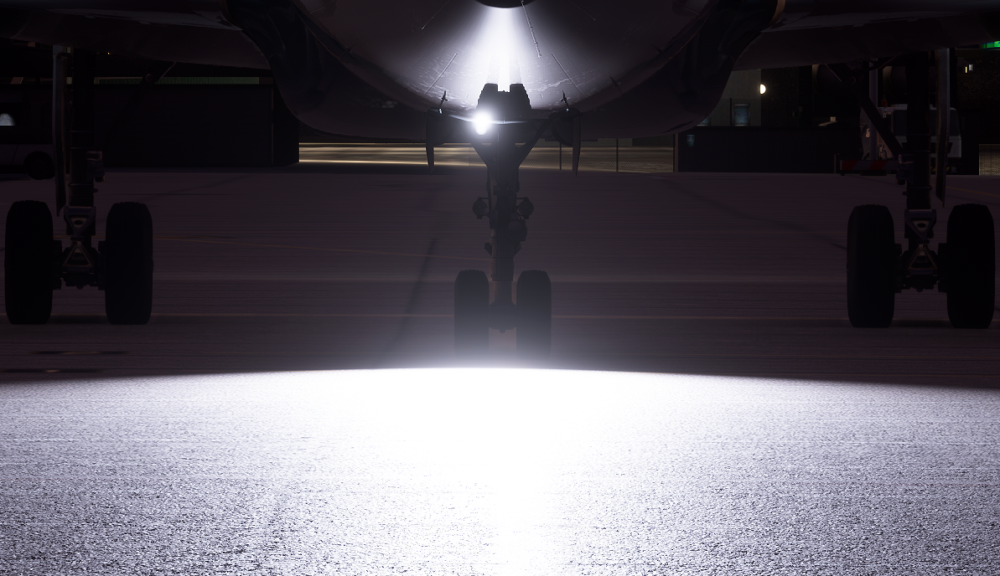

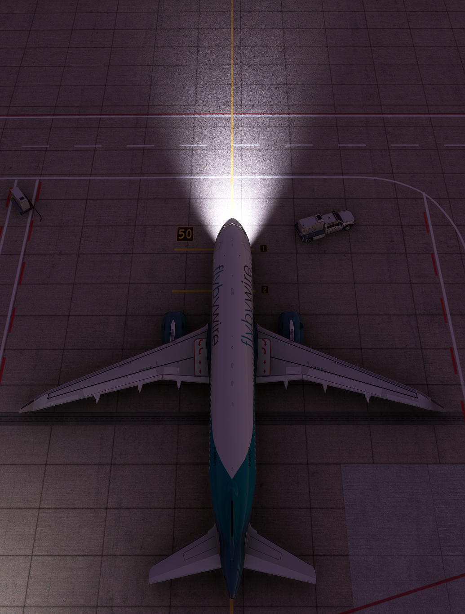

#### T.O.

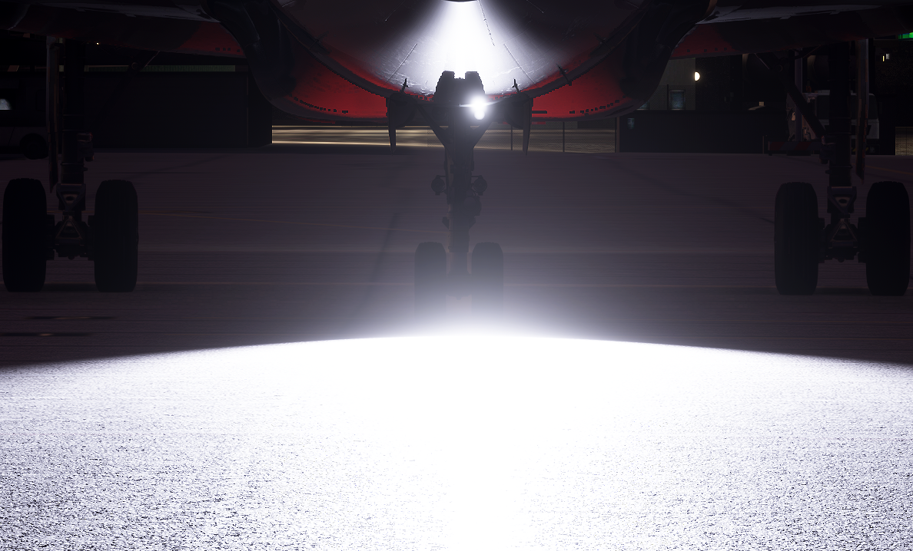

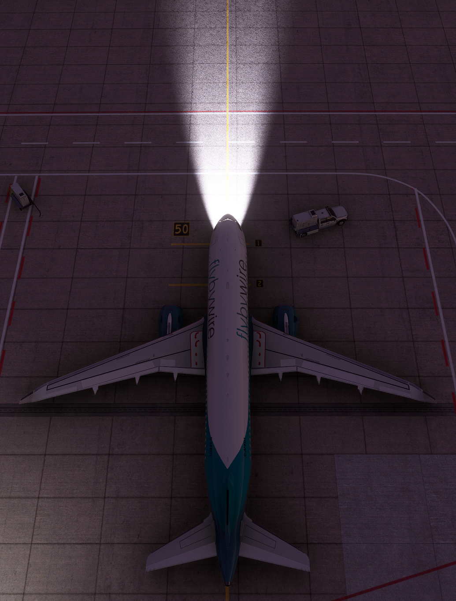

---

[Back to Flight Deck](../flight-deck.md){ .md-button }

