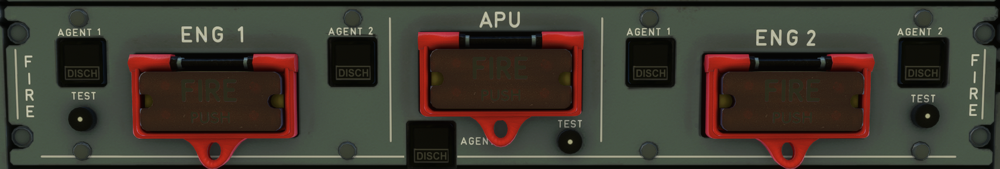

# Fire Control Panel

---

Back to [Flight Deck](../flight-deck.md)

---

## Description

A fire and overheat detection and extinguishing system is installed for:

- Each engine
- The APU

Smoke detection and fire extinguishing systems are installed for:

- The cargo compartments
- The lavatories

Smoke detection is also installed in the avionics bay.

Portable fire extinguishers are installed in:

- The cockpit
- The passenger cabin

## Extinguishing

- Each engine is equipped with two extinguisher bottles.
- The APU is provided with a single-shot fire extinguisher system.
- Fire bottle are equipped with an electrically operated squib for agent discharge.
- The discharge is controlled from the control panel or from the ground for the APU.

## Function

- When a sensing element is subjected to heat, it sends a signal to the FDU. As soon as both loops A and B detect temperature at a preset level, they trigger the fire warning system.

- Warning system is not affected by failure of a loop (break or loss of electrical supply). In case of failure of one loop, the second one secures the aircraft.

- If the system detects an APU fire while the aircraft is on the ground, it shuts down the APU automatically and discharges extinguishing agent. In flight, The flight crew controls the discharge of the fire extinguisher bottle, from the APU FIRE panel.

## Fire Protection Controls

- The Engine fire push-button allows the aircraft systems (bleed, hydraulic, IDG systems) to be isolated from the affected engine and the fire extinguisher bottle to be armed.
- The APU fire push-button allows the extinguishing system to be armed and the shut-down of the APU.
- The Agent push-button provides bottle discharge (ENG FIRE pushbutton or APU FIRE having being pushed).

---

Back to [Flight Deck](../flight-deck.md)
