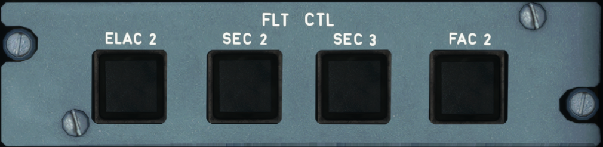

# Flight Control Panel - Left + Right

---

Back to [Flight Deck](../flight-deck.md)

---

- ELAC 
    - Normally ELAC 1 commands the operation of the ailerons and ELAC 2 commands the operation of the elevators and horizontal stabilizer. ELAC 1 and 2 perform the following:
        - Normal pitch and roll, normal LAF
        - Alternate pitch, alternate LAF
        - Direct pitch and roll
        - Aileron droop
        - Abnormal attitude
        - Acquisition of autopilot orders
- SEC 
    - The Spoiler Elevator Computers 1, 2, and 3 command spoiler operation. The SECs control the following
        - Normal roll by controlling the spoilers
        - Speed brakes and ground spoilers
        - Alternate pitch (SEC 1 and SEC 2 only)
        - Direct pitch (SEC 1 and SEC 2 only)
        - Alternate LAF
        - Abnormal attitude
        - Direct roll
- FAC 
    - The Flight Augmentation Computers have three main functions:
        - Rudder trim
        - Rudder travel limits
        - Yaw damping inputs
        - Alternate yaw
        - Flight envelope and speed computations
        - Wind shear detection
---

Back to [Flight Deck](../flight-deck.md)