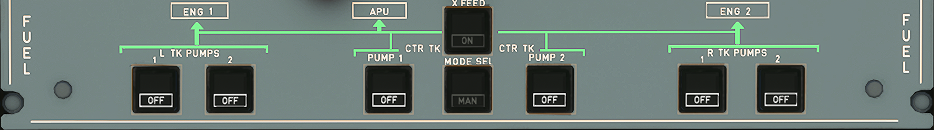

# Fuel Control Panel

---

Back to [Flight Deck](../flight-deck.md)

---

## Basic Layout

Total Fuel Capacity:

- Two outer tanks: 1,760 liters (1,408kg)
- Two inner tanks: 13,849 liters (11,079kg)
- One center tank: 8,250 liters (6,600kg)

Ventilation

- Each tank is separately ventilated via surge tanks at each wing tip.
- The center tank is ventilated via the LH surge tank.
- The surge tanks are opened to atmosphere via flame arrestors and NACA inlets.
- Vent valves ensure correct operation of the vent system.
- Pressure relief outlets protect the tanks from over-	or under- pressure.

## Control and Indications:

No crew action is required for normal operation.

- Fuel data (quantity, temperature) are available from a Fuel Quantity Indication (FQI) system
- Fuel quantity is permanently displayed on upper ECAM DU
- Fuel system synoptic on lower ECAM DU is displayed according to ECAM logic
- Low level warning is totally independent from FQI.

Abnormal operations:

- Fuel feed sequence may be operated manually
- One or both engines may be fed from any tank via cross-feed valve
- Gravity feed is possible from wing tanks.

## Control and Monitoring

- The Fuel System is automatically controlled by the Fuel Quantity Indication Computer (FQIC).

- This computer assures functioning of the Fuel Quantity Indication System (FQIS) and the two Fuel Level Sensor Control Units (FLSCU).

- FQIS and FLSCU provide:

    - Fuel quantity measurement and indication
    - Fuel transfer control
    - Level sensing
    - Fuel temperature indication
    - Refuel/defuel control
    - Signals to FADEC for IDG cooling control

## Control and Indications:

No crew action is required for normal operation.

- Fuel data (quantity, temperature) are available from a Fuel Quantity Indication (FQI) system
- Fuel quantity is permanently displayed on upper ECAM DU
- Fuel system synoptic on lower ECAM DU is displayed according to ECAM logic
- Low level warning is totally independent from FQI.

Abnormal operations:

- Fuel feed sequence may be operated manually
- One or both engines may be fed from any tank via cross-feed valve
- Gravity feed is possible from wing tanks.

## Engine Feed:

- Fuel is delivered to the engines by means of booster pumps.
    - Each tank is equipped with two identical booster pumps.
    - Center tank feeds first, except during take-off and fuel recirculation when center tank pumps are switched off automatically.
    - Wing tank pumps operate permanently at a lower pressure than center tank pumps.
    - Thus, when center tank pumps stop, engine feed comes automatically from wing tank pumps.

- Two electrical transfer valves are installed on each wing.
They automatically open when the inner tank fuel reaches a low level (about 750kg) for fuel to drain from the outer to the inner tanks.

- Fuel is recirculated automatically and transparently to the crew:
It ensures the IDG cooling (CFM and IAE eng.) and the engine oil cooling (IAE only) through a set of valves controlled by the FADEC.

## Refueling:

- Refuel/defuel control is performed from external panels located in the fuselage fairing under the RH wing within easy reach from the ground.

- One refuel/defuel coupling is located under the RH wing.

- Identical coupling on LH wing is available as an option.

- Refuelling is auto sequenced:

- It starts with the outer tanks. If the selected fuel quantity exceeds the wing tank capacity, the center tank is refuelled simultaneously.

- Refuelling time at nominal pressure is approximately 25 minutes for all tanks.

- Gravity refuelling can be achieved by overwing refuelling points.

---

Back to [Flight Deck](../flight-deck.md)

