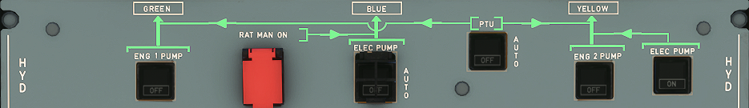

# Hydraulics Control Panel

## Description

The aircraft has three fully independent systems: Green, Yellow, Blue.

Normal operation functioning description:

- Green and Yellow system are pressurized by an engine-driven pump (one pump for each system)
- Blue system is pressurized by an electric pump

Abnormal operation description:

- If engine No. 1 is inoperative or Green pump has failed : The Green system is pressurized by the reversible Power Transfer Unit (PTU)
- If engine No. 2 is inoperative or Yellow pump has failed : The Yellow system is pressurized by the reversible PTU
- In case of dual engine failure or total electrical power loss:
The Ram Air Turbine (RAT) will pressurize the Blue system.

On ground:

- Blue and Yellow systems can be pressurized by electric pumps.
A handpump (operated from the ground on the yellow system) facilitates manoeuvring of the cargo doors.
- Green/Yellow system can be pressurized by the PTU.

---

Back to [Flight Deck](../flight-deck.md)

