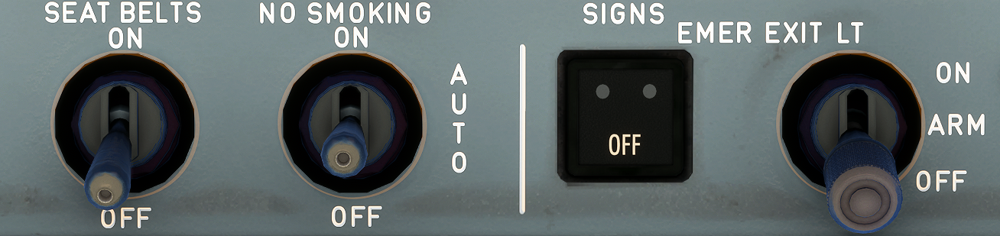

# Signs Panel

---

Back to [Flight Deck](../flight-deck.md)

---

## Controls and Indications

### EMER EXIT LT

The selector has three detent positions.

- ON:
    - Overhead emergency lights, EXIT signs and proximity marking system come on.
- OFF:
    - Above lights are off.
- ARM:
    - The proximity emergency escape path marking system and overhead emergency lighting come on if:
        - Normal aircraft electrical power system fails or
        - DC SHED ESS BUS fails or
        - AC BUS 1 fails.
    - Exit signs come on if:
        - Normal aircraft electrical power system fails or
        - DC SHED ESS BUS fails
        - Note: The LIGHT EMER pushbutton on the purser's panel can turn on the emergency lighting independently of the positions of this selector switch.

### EMER EXIT LT

- OFF Lt:
    - This light comes on amber when the EMER EXIT LT selector is selected OFF.

###  SEAT BELTS

- ON:
    - FASTEN SEAT BELT and RETURN TO SEAT signs come on together with a low tone chime.
- OFF:
    - Signs are off. Low tone chime sounds upon extinction of lights (depending on the CIDS/CAM programming).

### NO SMOKING

- ON:
    - NO SMOKING and EXIT signs come on together with a low tone chime.
- AUTO:
    - NO SMOKING and EXIT signs come on when landing gear is extended and go off when landing gear is retracted. Low tone chime sounds (depending on the CIDS/CAM programming) when the lights go on or off.
- OFF:
    - Signs are off. Low tone chime sounds upon extinction of lights (depending on the CIDS/CAM programming).

Note : If the cabin altitude goes above 11300 feet (± 350 feet), the cabin illuminates (depending on the CIDS/CAM programming) and the NO SMOKING, FASTEN SEAT BELT, EXIT signs come on regardless of SEAT BELTS and NO SMOKING selector switches.

---

Back to [Flight Deck](../flight-deck.md)
