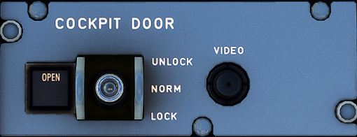

# Cockpit Door Panel

---

Back to [Flight Deck](../flight-deck.md)

---

# Description

A forward-opening hinge door separates the cockpit from the passenger compartment. It has three electric locking strikes, controlled by the flight crew. In normal conditions, when the door is closed, they remain locked. When there is a request to enter the cockpit, the flight crew can authorize entry by unlocking the door, that remains closed until it is pushed open.

When the flight crew does not respond to requests for entry, the door can also be unlocked by the cabin crew, by entering a two to seven-digit code (programmed by the airline) on the keypad, installed on the lateral side of the Forward Attendant Panel (FAP).

The door is bulletproof and fully compliant with rapid decompression requirements.

A mechanical override enables the flight crew to open the door from the cockpit side.

A deadbolt is installed at the level of the center latch area of the cockpit door. This deadbolt bolts the door from the cockpit side, in the event that more than one locking latch strike fails, or in the case of a total CDLS failure.

The Cockpit Door Locking System (CDLS) provides a means of electrically locking and unlocking the cockpit door. This system is mainly composed of:

- A keypad, located in the forward cabin, near the cockpit door,
- A toggle switch, located in the center pedestal’s Cockpit Door panel,
- A control unit and its CKPT DOOR CONT normal panel, located on the overhead panel,
- A buzzer.

The keypad enables the cabin crew to request access to the cockpit. There are two different access request types: “Routine” and “Emergency” access request.

The toggle switch enables the flight crew to lock or unlock the cockpit door, following an access request, thereby allowing or denying the entry to the cockpit.

The cockpit door control unit is the system controller, in charge of:
‐ Locking or unlocking the door latches, upon flight crew action.
‐ Unlocking the door, in case of cockpit decompression (the door then opens towards the cockpit under differential pressure).
‐ Indicating system failures of electrical latches and pressure sensors.
‐ Activating the access request buzzer and turning on the keypad LEDs.

The buzzer sounds in the cockpit for 1 to 9s to indicate that a routine access request has been made, or sounds continuously if an emergency access procedure has been initiated.

# Controls and Indications

### COCKPIT DOOR toggle switch

- UNLOCK position:
    - This position is used to enable the cabin crew member to open the door. The switch must be pulled and maintained in the unlock position until the door is pushed open.
- NORM position:
    - All latches are locked, and EMERGENCY access is possible for the
    cabin crew.
- LOCK position:
    - Once the button has been moved to this position, the door is locked ; emergency access, the buzzer, and the keypad are inhibited for a
      preselected time (5 to 20 min).

- Note:
    - If the LOCK position has not been used by the pilot, for at least 5 to 20 min, the cabin crew is able to request emergency access to open the cockpit door.
    - The UNLOCK position overrides and resets any previous selection.
    - In case of an electrical supply failure, the cockpit door is automatically unlocked, but remains closed.

### COCKPIT DOOR Fault Open indicator

- OPEN light ON:
    - The door is not closed.
- OPEN light flashes:
    - The cabin crew has started an emergency access procedure. If there
    is no reaction from the flight crew, the door will unlock at the end of the adjustable time delay (15 to 120 s).
- FAULT:
    - This light comes on when a system failure has been identified
      (Example : Latch, pressure sensors, control unit). The inoperative item can be identified by checking the strike and pressure sensor status lights on the CKPT DOOR CONT panel.

---

Back to [Flight Deck](../flight-deck.md)
