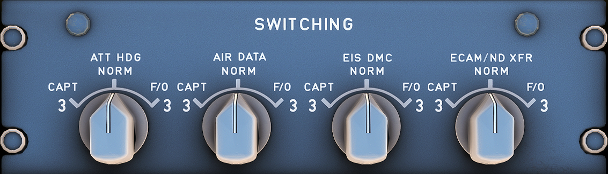

# Switching Panel

---

Back to [Flight Deck](../flight-deck.md)

---

## Description

To have maximal redundancy A320 pilots can switch backup computers or data sources to be used for either the Captain's or First Officer's displays.

## Controls and Indications

### ATT HDG Selector

- NORM:
    - IR 1 supplies data to PFD 1, ND 1, and DDRMI/VOR DME. IR 2 supplies data to PFD 2 and ND 2.
- CAPT 3:
    - IR 3 replaces IR 1 and supplies data to PFD 1, ND 1, and DDRMI / VOR DME.
- F/O 3:
    - IR 3 replaces IR 2 and supplies data to PFD 2 and ND 2.

### AIR DATA Selector

- NORM:
    - ADR 1 supplies data to PFD 1 and ND 1. ADR 2 supplies data to PFD 2 and ND 2.
- CAPT 3:
    - ADR 3 replaces ADR 1 and supplies data to PFD 1, and ND 1.
- F/O 3:
    - ADR 3 replaces ADR 2 and supplies data to PFD 2 and ND 2.

### EIS DMC Selector

This switch enables the flight crew to replace the Captain or First Officer's Display Management Computer (DMC 1, or DMC 2) by DMC 3.

- NORM:
    - DMC 1 supplies data to PFD 1, ND 1, and the upper ECAM DU.
    - DMC 2 supplies data to PFD 2, ND 2, and the lower ECAM DU.
- CAPT 3:
    - DMC 3 replaces DMC 1.
- F/O 3:
    - DMC 3 replaces DMC 2.

Note: If a DMC fails, each of its associated DUs displays a diagonal line.

### ECAM/ND XFR Selector

The switch on the right-hand side of the SWITCHING panel enables the flight crew to transfer the ECAM System Display to either the Captain or First Officer's Navigation Display.

- NORM:
    - The System Display (SD) appears on lower ECAM.
- CAPT:
    - Transfers the System Display to Captain's ND.
- F/O:
    - Transfers the System Display to First Officer's ND.

---

Back to [Flight Deck](../flight-deck.md)
