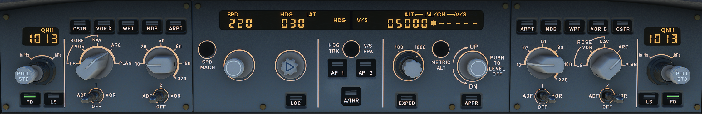

---
hide:
    - navigation
    - toc
---

# Glareshield

{usemap="#glare_map" style="max-width:1188px;min-width:1188px;height=auto;"}

<map name="glare_map">
    <area shape="rect" coords="0,0,325,190" href="/a32nx-systems-briefing/glareshield/efis_control/" alt="EFIS Control">
    <area shape="rect" coords="326,0,863,190" href="/a32nx-systems-briefing/glareshield/fcu/" alt="Flight Control Unit (FCU)">
    <area shape="rect" coords="864,1,1186,190" href="/a32nx-systems-briefing/glareshield/efis_control/" alt="EFIS Control">
</map>

[Flight Deck](../flight_deck.md)
