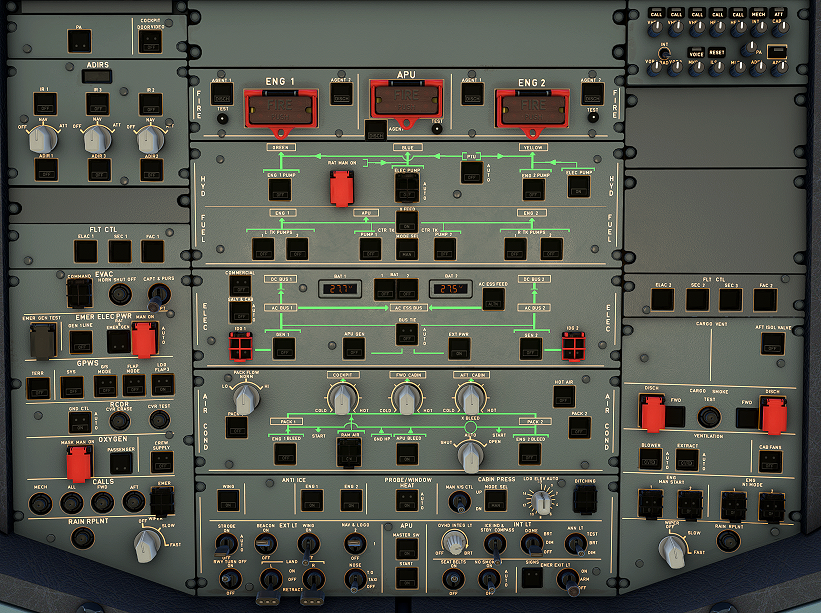

# Overhead Panel

{usemap="#ovhd_map"}

<map name="ovhd_map">
  <area alt="test2" shape="rect" coords="187,68,626,142" href="/a32nx-systems-briefing/ovhd/fire/">
  <area alt="test3" shape="rect" coords="190,142,623,269" href="/a32nx-systems-briefing/ovhd/hyd/">
  <area alt="test4" shape="rect" coords="189,269,624,369" href="/a32nx-systems-briefing/ovhd/fuel/">
</map>

[Flight Deck](../flight_deck.md)
